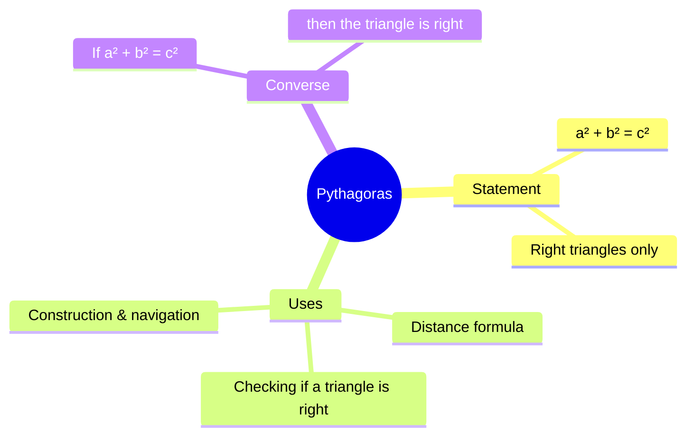

# Pythagorean Theorem

> [!abstract] The idea in one line
> In any **right triangle**, the square of the hypotenuse equals the sum of the squares of the other two sides.

$$
a^2 + b^2 = c^2
$$

where **c** is the *hypotenuse* (the side opposite the 90° angle) and **a**, **b** are the two legs.

---

## 🔺 The Picture

### ASCII version

```text
        |\
        | \
        |  \        c² = a² + b²
      b |   \
        |    \  c
        |     \
        |______\
     90°    a
```

### SVG version (renders directly in Obsidian)

A 3-4-5 triangle (a=60, b=80, c=100) with a square drawn on every side:

<svg width="340" height="280" viewBox="0 0 340 280" xmlns="http://www.w3.org/2000/svg">
  <!-- Square on leg b (left of the vertical leg) -->
  <rect x="70" y="110" width="80" height="80" fill="#ffd43b" fill-opacity="0.35" stroke="#f59f00"/>
  <!-- Square on leg a (below the bottom leg) -->
  <rect x="150" y="190" width="60" height="60" fill="#4dabf7" fill-opacity="0.35" stroke="#1971c2"/>
  <!-- Square on hypotenuse c (outward, tilted) -->
  <polygon points="150,110 210,190 290,130 230,50" fill="#ff8787" fill-opacity="0.30" stroke="#e03131"/>
  <!-- Right triangle -->
  <polygon points="150,110 210,190 150,190" fill="#ffffff" fill-opacity="0.9" stroke="#333" stroke-width="2"/>
  <!-- Right-angle marker -->
  <rect x="150" y="175" width="15" height="15" fill="none" stroke="#999"/>
  <!-- Area labels on the squares -->
  <text x="110" y="156" font-size="16" fill="#e67700" text-anchor="middle" font-weight="bold">b²</text>
  <text x="180" y="226" font-size="16" fill="#1864ab" text-anchor="middle" font-weight="bold">a²</text>
  <text x="220" y="124" font-size="16" fill="#c92a2a" text-anchor="middle" font-weight="bold">c²</text>
  <!-- Side labels inside the triangle -->
  <text x="160" y="152" font-size="14" fill="#333">b</text>
  <text x="180" y="184" font-size="14" fill="#333">a</text>
  <text x="166" y="164" font-size="14" fill="#333">c</text>
  <text x="154" y="172" font-size="10" fill="#888">90°</text>
</svg>

> [!tip] What the squares mean
> The theorem isn't about the *sides* — it's about the **squares drawn on the sides**: the red area (c²) exactly equals the blue + yellow areas (a² + b²).

---

## 🧠 Why it's true (one-line intuition)

The area of the big square built on the hypotenuse can be rearranged, piece by piece, into the two smaller squares on the legs — nothing is added or lost.



---

## ✏️ Worked example

A ladder leans against a wall. The base is **3 m** from the wall, the top touches at **4 m** height. How long is the ladder?

$$
\begin{aligned}
c^2 &= a^2 + b^2 \\
c^2 &= 3^2 + 4^2 = 9 + 16 = 25 \\
c &= \sqrt{25} = 5 \text{ m}
\end{aligned}
$$

> [!example] Common right triangles (Pythagorean triples)
>
> | a | b | c | Scale |
> |---|---|---|-------|
> | 3 | 4 | 5 | ×1, ×2, ×3… |
> | 5 | 12 | 13 | ×1, ×2, ×3… |
> | 8 | 15 | 17 | ×1, ×2… |
> | 7 | 24 | 25 | ×1, ×2… |

---

## ⚠️ Gotchas

> [!warning] Common mistakes
> 1. **c must be the hypotenuse** — the longest side, opposite the right angle. Writing `3² + 5² = 4²` is wrong.
> 2. **It only works for right triangles.** No 90° angle → no theorem.
> 3. **Don't forget the square root.** `a² + b² = 25` means `c = 5`, not `25`.

> [!info] The converse
> If a triangle's sides satisfy a² + b² = c², the triangle **must** be right-angled. Builders use this (the 3-4-5 rule) to check corners are square.

---

## 🔗 Related

- Distance formula: $d = \sqrt{(x_2-x_1)^2 + (y_2-y_1)^2}$ — just Pythagoras in disguise
- Trigonometry (SOH-CAH-TOA) — built on right triangles
- [[Law of Cosines]] — the generalization for *any* triangle
