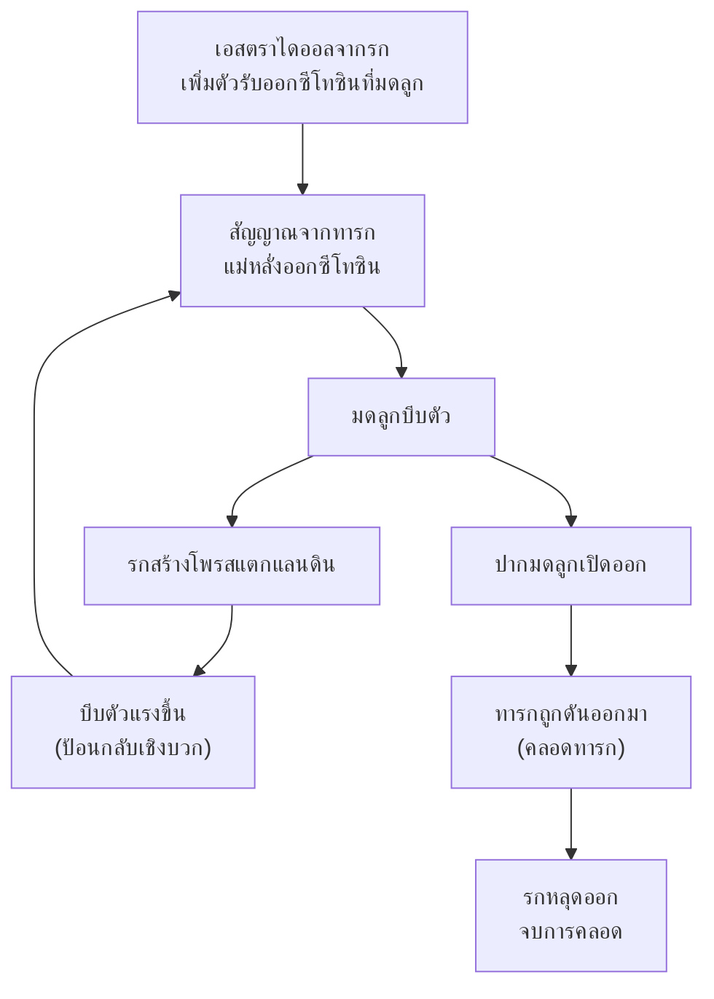

# การเจริญเติบโตของมนุษย์ (Human Development)

> [!abstract] สรุปในหนึ่งบรรทัด
> มนุษย์ปฏิสนธิภายใน เอ็มบริโอเจริญในมดลูก: 18–36 ชั่วโมงหลังปฏิสนธิเริ่มคลีเวจ → บลาสโทชิสต์ฝังตัวที่ผนังมดลูก → อายุ 2 สัปดาห์เริ่มแกสทรูเลชัน → 8 สัปดาห์อวัยวะครบ จบระยะเอ็มบริโอเป็น **fetus** → คลอดเมื่ออายุครรภ์ประมาณ 40 สัปดาห์

## 🖼 ภาพประกอบ

<svg width="420" height="280" viewBox="0 0 420 280" xmlns="http://www.w3.org/2000/svg">
  <text x="215" y="24" font-size="14" font-weight="bold" fill="#333" text-anchor="middle">ไทม์ไลน์การตั้งครรภ์ 40 สัปดาห์</text>
  <!-- แถบไตรมาส -->
  <rect x="30" y="110" width="120" height="32" rx="6" fill="#4dabf7" fill-opacity="0.18" stroke="#1971c2" stroke-width="1.5"/>
  <text x="90" y="130" font-size="12" font-weight="bold" fill="#1971c2" text-anchor="middle">ไตรมาสที่ 1</text>
  <rect x="150" y="110" width="120" height="32" rx="6" fill="#ffd43b" fill-opacity="0.2" stroke="#f59f00" stroke-width="1.5"/>
  <text x="210" y="130" font-size="12" font-weight="bold" fill="#f59f00" text-anchor="middle">ไตรมาสที่ 2</text>
  <rect x="270" y="110" width="130" height="32" rx="6" fill="#69db7c" fill-opacity="0.18" stroke="#2f9e44" stroke-width="1.5"/>
  <text x="335" y="130" font-size="12" font-weight="bold" fill="#2f9e44" text-anchor="middle">ไตรมาสที่ 3</text>
  <!-- แกนเวลา -->
  <line x1="30" y1="150" x2="400" y2="150" stroke="#333" stroke-width="2"/>
  <text x="30" y="170" font-size="11" fill="#868e96">สัปดาห์ 0</text>
  <text x="400" y="170" font-size="11" fill="#868e96" text-anchor="end">40</text>
  <!-- เหตุการณ์บนแกน -->
  <circle cx="30" cy="150" r="5" fill="#4dabf7" stroke="#1971c2"/>
  <circle cx="48" cy="150" r="5" fill="#4dabf7" stroke="#1971c2"/>
  <circle cx="67" cy="150" r="5" fill="#4dabf7" stroke="#1971c2"/>
  <circle cx="104" cy="150" r="5" fill="#ff8787" stroke="#e03131"/>
  <circle cx="39" cy="150" r="5" fill="#4dabf7" stroke="#1971c2"/>
  <circle cx="58" cy="150" r="5" fill="#4dabf7" stroke="#1971c2"/>
  <circle cx="397" cy="150" r="5" fill="#2f9e44" stroke="#2f9e44"/>
  <!-- ป้ายเหนือแกน -->
  <text x="38" y="90" font-size="11" fill="#333" text-anchor="middle">ปฏิสนธิ</text>
  <line x1="30" y1="96" x2="30" y2="145" stroke="#868e96" stroke-width="1"/>
  <text x="70" y="72" font-size="11" fill="#333" text-anchor="middle">สปดาห์ 2 แกสทรูเลชัน</text>
  <line x1="48" y1="78" x2="48" y2="145" stroke="#868e96" stroke-width="1"/>
  <text x="120" y="90" font-size="11" fill="#333" text-anchor="middle">สปดาห์ 4 หัวใจเริ่มเต้น</text>
  <line x1="67" y1="96" x2="67" y2="145" stroke="#868e96" stroke-width="1"/>
  <text x="180" y="72" font-size="11" fill="#e03131" text-anchor="middle" font-weight="bold">สปดาห์ 8 จบระยะเอ็มบริโอ</text>
  <line x1="104" y1="78" x2="104" y2="145" stroke="#e03131" stroke-width="1"/>
  <!-- ป้ายใต้แกน -->
  <text x="52" y="222" font-size="11" fill="#333" text-anchor="middle">18–36 ชม. เริ่มคลีเวจ</text>
  <line x1="39" y1="212" x2="39" y2="155" stroke="#868e96" stroke-width="1"/>
  <text x="110" y="240" font-size="11" fill="#333" text-anchor="middle">สปดาห์ 1 บลาสโทชิสต์ฝังตัว</text>
  <line x1="45" y1="230" x2="40" y2="155" stroke="#868e96" stroke-width="0"/>
  <text x="200" y="222" font-size="11" fill="#333" text-anchor="middle">สปดาห์ 3 หลอดประสาทเริ่มเกิด</text>
  <line x1="58" y1="212" x2="58" y2="155" stroke="#868e96" stroke-width="1"/>
  <text x="360" y="222" font-size="11" fill="#333" text-anchor="middle">สปดาห์ 40 คลอด</text>
  <line x1="397" y1="212" x2="397" y2="155" stroke="#868e96" stroke-width="1"/>
  <!-- คำอธิบาย -->
  <text x="215" y="262" font-size="12" fill="#868e96" text-anchor="middle">8 สัปดาห์แรก = ระยะเอ็มบริโอ หลังจากนั้นเรียก fetus จนถึงวันคลอด</text>
</svg>

## 🧠 ทำความเข้าใจ

มนุษย์ปฏิสนธิ**ภายใน** (อสุจิผสมไข่ในท่อนำไข่) เอ็มบริโอเจริญต่อไปในมดลูกและคลอดออกมาเป็นทารก ลำดับเหตุการณ์สำคัญ:

1. **18–36 ชั่วโมงหลังปฏิสนธิ** — ไซโกตเริ่มคลีเวจ (แบ่งเซลล์ทวีคูณขณะเคลื่อนเข้ามดลูก)
2. **ราวสัปดาห์ที่ 1** — เกิดบลาสทูเลชันเป็น**บลาสโทชิสต์** แล้วเคลื่อนมา**ฝังตัว (implantation)** ที่ผนังมดลูกชั้นใน (เอนโดมีเทรียม)
3. **ราวสัปดาห์ที่ 2** — เริ่มแกสทรูเลชัน (จัด 3 ชั้นเนื้อเยื่อ) และออร์แกโนเจเนซิส
4. **สัปดาห์ที่ 3** — ออร์แกโนเจเนซิสเริ่มจาก**ระบบประสาท** (หลอดประสาทเริ่มเกิด)
5. **สัปดาห์ที่ 4** — อวัยวะเริ่มเจริญ: หัวใจเป็นท่อและ**เริ่มเต้นเป็นจังหวะ** แขนขาเริ่มปรากฏ
6. **สัปดาห์ที่ 8** — อวัยวะต่าง ๆ เจริญครบ จบระยะเอ็มบริโอ → เรียกว่า **fetus** จากนี้คือการ "โตขยาย" จนคลอด

### ไตรมาสทั้ง 3 (trimester)

| ไตรมาส | สิ่งที่เกิดขึ้นเด่นชัด |
|---|---|
| **ที่ 1** (สปดาห์ 0–13) | สร้างอวัยวะหลัก เห็นใบหน้า นิ้วมือ นิ้วเท้าชัดเจน อวัยวะสืบพันธุ์เห็นได้ชัด |
| **ที่ 2** (สปดาห์ 13–26) | fetus โตขึ้นเรื่อย ๆ เคลื่อนไหวมากขึ้น มีกระดูก ผม ขน และเริ่มได้ยินเสียงการเต้นของหัวใจ |
| **ที่ 3** (สปดาห์ 26–40) | fetus โตมากขึ้น อวัยวะต่าง ๆ และระบบประสาทพัฒนาดีมาก เตรียมพร้อมออกมาใช้ชีวิตนอกครรภ์ |

### รก (placenta) และสายสะดือ (umbilical cord)

- รกเจริญมาจาก**คอเรียนของเอ็มบริโอ** เชื่อมกับผนังมดลูกชั้นในของแม่
- ทำหน้าที่**แลกเปลี่ยนสารระหว่างแม่กับลูก**: ส่งสารอาหาร antibody และออกซิเจนให้ และรับของเสีย (คาร์บอนไดออกไซด์) ออก — โดยเลือดแม่กับเลือดลูก**ไม่ปะปนกันโดยตรง**
- สร้างฮอร์โมนสำคัญ: **hCG (human chorionic gonadotropin)**, **estrogen**, **progesterone** — hCG คือตัวที่ชุดตรวจการตั้งครรภ์จับได้
- ทารกอยู่ภายใน**ถุงน้ำครำ** บรรจุ**น้ำครำ (amniotic fluid)** ป้องกันการกระทบกระเทือนและช่วยให้เอ็มบริโอเคลื่อนไหวได้

### กระบวนการคลอด (parturition) — วงจรป้อนกลับเชิงบวก

เหตุการณ์คลอดเป็น**วงจรป้อนกลับเชิงบวก (positive feedback)** — ยิ่งบีบตัว ยิ่งสร้างฮอร์โมนกระตุ้นให้บีบมากขึ้น ไม่หยุดจนกว่าทารกและรกจะออกมาจบ

## ✏️ ตัวอย่างการใช้งาน

**ทำไมแพทย์เน้นดูแล "สามเดือนแรก" ของการตั้งครรภ์?** เพราะช่วงไตรมาสที่ 1 คือระยะออร์แกโนเจเนซิส — อวัยวะทั้งหมดกำลังถูกสร้าง ถ้ามีสารเคมี ไวรัส หรือยาเข้าไปรบกวนในช่วงนี้ อวัยวะจะสร้างพลาดได้ง่ายที่สุด ต่างจากไตรมาสหลัง ๆ ที่ส่วนใหญ่เป็นการโตขยายของอวัยวะที่สร้างเสร็จแล้ว

**ตัวอย่างใกล้ตัว:** ชุดตรวจการตั้งครรภ์อ่านค่าจาก **hCG** ที่ปัสสาวะ — ฮอร์โมนนี้สร้างจากรกเท่านั้น เมื่อพบแปลว่ามีรกกำลังทำงานอยู่ นี่คือตัวอย่างที่ความรู้เรื่องรกถูกใช้จริงในชีวิตประจำวัน

## ⚠️ ข้อควรระวัง

> [!warning] ข้อผิดพลาดที่พบบ่อย
> 1. เรียกทารกในครรภ์ว่า "เอ็มบริโอ" ตลอดการตั้งครรภ์ — จบระยะเอ็มบริโอที่**สัปดาห์ที่ 8** หลังจากนั้นเรียก **fetus** จนถึงคลอด
> 2. คิดว่ารกเป็นส่วนของแม่หรือของลูกอย่างเดียว — รกเกิดจากการรวมกันของ**คอเรียนของลูก**กับ**ผนังมดลูกชั้นในของแม่**
> 3. คิดว่าเลือดแม่กับเลือดลูกไหลผสมกันที่รก — ไม่ปะปนโดยตรง! มีเยื่อบาง ๆ กั้น สารถูกแลกเปลี่ยนผ่านเยื่อ
> 4. คิดว่าการคลอดเป็นวงจรป้อนกลับลบ — จริง ๆ เป็น**เชิงบวก** ยิ่งบีบยิ่งกระตุ้นให้บีบต่อจนคลอดเสร็จ
> 5. ลืมว่าระบบประสาทถูกสร้างก่อน — ออร์แกโนเจเนซิสของมนุษย์เริ่มที่ระบบประสาทใน**สัปดาห์ที่ 3**

## 🏋️ แบบฝึกหัดแยกไฟล์

> [!info] จัดโจทย์แยกแล้ว
> เปิดดัชนีด้านล่างเพื่อเลือกทำทีละข้อและเปิดเฉลยเมื่อพร้อม

- [[ชีววิทยา/เอ็มบริโอ/โจทย์/การเจริญเติบโตของมนุษย์/ดัชนีโจทย์]] — รายการโจทย์ของบทนี้

## 🎴 การ์ดทบทวน #flashcards

หลังปฏิสนธินานเท่าไรไซโกตจึงเริ่มคลีเวจ?::ประมาณ 18–36 ชั่วโมง

บลาสโทชิสต์ของมนุษย์ฝังตัวที่ตำแหน่งใด?::ผนังมดลูกชั้นใน (เอนโดมีเทรียม) ราวสัปดาห์ที่ 1 ของการตั้งครรภ์

ระยะเอ็มบริโอจบเมื่ออายุครรภ์เท่าไร แล้วเรียกว่าอะไร?::จบที่สัปดาห์ที่ 8 เมื่ออวัยวะครบ — หลังจากนั้นเรียก fetus

ออร์แกโนเจเนซิสของมนุษย์เริ่มจากระบบใด และเริ่มสัปดาห์ที่เท่าไร?::เริ่มจากระบบประสาท ในสัปดาห์ที่ 3

รกเจริญมาจากอะไร และทำหน้าที่อะไร?::เจริญจากคอเรียนของเอ็มบริโอ + ผนังมดลูกแม่ แลกเปลี่ยนสารอาหาร antibody แก๊ส และของเสีย

รกสร้างฮอร์โมนอะไรบ้าง?::hCG (human chorionic gonadotropin) estrogen และ progesterone

กระบวนการคลอดเป็นวงจรป้อนกลับแบบใด?::เชิงบวก (positive feedback) — มดลูกบีบตัว รกสร้างโพรสแตกแลนดิน กระตุ้นให้บีบมากขึ้นจนทารกและรกออกมา

## 🔗 หัวข้อที่เกี่ยวข้อง

- [[บลาสทูเลชัน]] — บลาสโทชิสต์คือระยะที่ฝังตัวในมดลูก
- [[ออร์แกโนเจเนซิส]] — เหตุการณ์หลักของไตรมาสแรก
- [[เยื่อหุ้มเอ็มบริโอ]] — คอเรียนกับแอลแลนทอยส์กลายเป็นรกและสายสะดือ
- [[การเจริญเติบโตของสัตว์]] — ภาพรวมทั้ง 4 ระยะของเอ็มบริโอ
