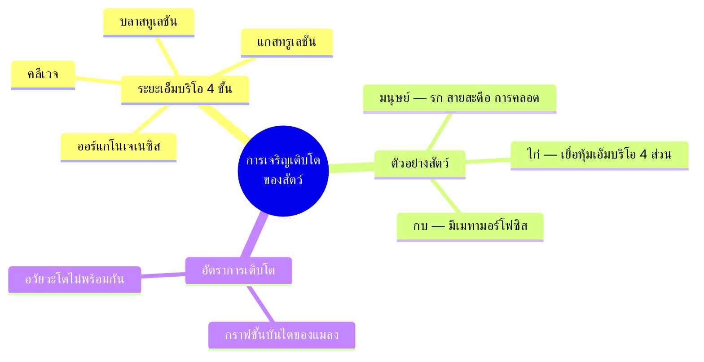

# การเจริญเติบโตของสัตว์ (Animal Growth and Development)

> [!abstract] สรุปในหนึ่งบรรทัด
> สัตว์หนึ่งตัวเริ่มจาก**ไซโกตเพียงเซลล์เดียว** แล้วเจริญเติบโตผ่าน 2 กระบวนการคู่กัน คือ **การเติบโต (growth)** = เพิ่มจำนวน + ขยายขนาดเซลล์ และ **การเจริญ (development)** = เปลี่ยนสภาพเซลล์ + สร้างรูปร่าง จนได้ตัวเต็มวัยที่มีอวัยวะครบทุกระบบ

## 🖼 ภาพประกอบ

<svg width="420" height="290" viewBox="0 0 420 290" xmlns="http://www.w3.org/2000/svg">
  <defs>
    <marker id="arrowHub" viewBox="0 0 10 10" refX="9" refY="5" markerWidth="6" markerHeight="6" orient="auto-start-reverse"><path d="M 0 0 L 10 5 L 0 10 z" fill="#333"/></marker>
  </defs>
  <text x="210" y="22" font-size="14" font-weight="bold" fill="#333" text-anchor="middle">จากไซโกตเดียว สู่ตัวเต็มวัย</text>
  <!-- 1 ไซโกต -->
  <circle cx="38" cy="105" r="19" fill="#4dabf7" fill-opacity="0.35" stroke="#1971c2" stroke-width="2"/>
  <text x="38" y="145" font-size="12" font-weight="bold" fill="#1971c2" text-anchor="middle">ไซโกต</text>
  <text x="38" y="160" font-size="12" fill="#333" text-anchor="middle">1 เซลล์</text>
  <line x1="60" y1="105" x2="82" y2="105" stroke="#333" stroke-width="2" marker-end="url(#arrowHub)"/>
  <!-- 2 เซลล์ -->
  <circle cx="101" cy="105" r="10" fill="#4dabf7" fill-opacity="0.35" stroke="#1971c2" stroke-width="2"/>
  <circle cx="119" cy="105" r="10" fill="#4dabf7" fill-opacity="0.35" stroke="#1971c2" stroke-width="2"/>
  <text x="110" y="145" font-size="12" font-weight="bold" fill="#1971c2" text-anchor="middle">แบ่งเซลล์</text>
  <text x="110" y="160" font-size="12" fill="#333" text-anchor="middle">2, 4, 8, ...</text>
  <line x1="132" y1="105" x2="154" y2="105" stroke="#333" stroke-width="2" marker-end="url(#arrowHub)"/>
  <!-- โมรูลา -->
  <circle cx="185" cy="105" r="5" fill="#ffd43b" fill-opacity="0.7" stroke="#f59f00"/>
  <circle cx="196" cy="98" r="5" fill="#ffd43b" fill-opacity="0.7" stroke="#f59f00"/>
  <circle cx="196" cy="112" r="5" fill="#ffd43b" fill-opacity="0.7" stroke="#f59f00"/>
  <circle cx="163" cy="98" r="5" fill="#ffd43b" fill-opacity="0.7" stroke="#f59f00"/>
  <circle cx="163" cy="112" r="5" fill="#ffd43b" fill-opacity="0.7" stroke="#f59f00"/>
  <circle cx="179" cy="93" r="5" fill="#ffd43b" fill-opacity="0.7" stroke="#f59f00"/>
  <circle cx="179" cy="117" r="5" fill="#ffd43b" fill-opacity="0.7" stroke="#f59f00"/>
  <text x="179" y="145" font-size="12" font-weight="bold" fill="#f59f00" text-anchor="middle">โมรูลา</text>
  <text x="179" y="160" font-size="12" fill="#333" text-anchor="middle">ก้อนเบอร์รี่</text>
  <line x1="200" y1="105" x2="220" y2="105" stroke="#333" stroke-width="2" marker-end="url(#arrowHub)"/>
  <!-- บลาสทูลา -->
  <circle cx="248" cy="105" r="20" fill="#4dabf7" fill-opacity="0.25" stroke="#1971c2" stroke-width="2"/>
  <circle cx="248" cy="105" r="9" fill="#ffffff" fill-opacity="0.85"/>
  <text x="248" y="145" font-size="12" font-weight="bold" fill="#1971c2" text-anchor="middle">บลาสทูลา</text>
  <text x="248" y="160" font-size="12" fill="#333" text-anchor="middle">มีโพรงกลาง</text>
  <line x1="270" y1="105" x2="290" y2="105" stroke="#333" stroke-width="2" marker-end="url(#arrowHub)"/>
  <!-- แกสทรูลา -->
  <circle cx="316" cy="105" r="20" fill="#4dabf7" fill-opacity="0.3" stroke="#1971c2" stroke-width="2"/>
  <circle cx="316" cy="105" r="13" fill="#ffd43b" fill-opacity="0.45" stroke="#f59f00"/>
  <circle cx="316" cy="105" r="7" fill="#ff8787" fill-opacity="0.5" stroke="#e03131"/>
  <text x="316" y="145" font-size="12" font-weight="bold" fill="#e03131" text-anchor="middle">แกสทรูลา</text>
  <text x="316" y="160" font-size="12" fill="#333" text-anchor="middle">3 ชั้นเนื้อเยื่อ</text>
  <line x1="338" y1="105" x2="358" y2="105" stroke="#333" stroke-width="2" marker-end="url(#arrowHub)"/>
  <!-- ตัวเต็มวัย -->
  <circle cx="382" cy="88" r="9" fill="#69db7c" fill-opacity="0.5" stroke="#2f9e44" stroke-width="2"/>
  <line x1="382" y1="97" x2="382" y2="116" stroke="#2f9e44" stroke-width="2"/>
  <line x1="382" y1="102" x2="371" y2="110" stroke="#2f9e44" stroke-width="2"/>
  <line x1="382" y1="102" x2="393" y2="110" stroke="#2f9e44" stroke-width="2"/>
  <line x1="382" y1="116" x2="373" y2="130" stroke="#2f9e44" stroke-width="2"/>
  <line x1="382" y1="116" x2="391" y2="130" stroke="#2f9e44" stroke-width="2"/>
  <text x="382" y="145" font-size="12" font-weight="bold" fill="#2f9e44" text-anchor="middle">ตัวเต็มวัย</text>
  <text x="382" y="160" font-size="12" fill="#333" text-anchor="middle">อวัยวะครบ</text>
  <!-- แถบสองกระบวนการ -->
  <rect x="30" y="190" width="175" height="70" rx="10" fill="#4dabf7" fill-opacity="0.15" stroke="#1971c2" stroke-width="2"/>
  <text x="117" y="212" font-size="13" font-weight="bold" fill="#1971c2" text-anchor="middle">การเติบโต (growth)</text>
  <text x="117" y="231" font-size="12" fill="#333" text-anchor="middle">1. เพิ่มจำนวนเซลล์</text>
  <text x="117" y="248" font-size="12" fill="#333" text-anchor="middle">2. ขยายขนาดเซลล์</text>
  <rect x="215" y="190" width="175" height="70" rx="10" fill="#ffd43b" fill-opacity="0.2" stroke="#f59f00" stroke-width="2"/>
  <text x="302" y="212" font-size="13" font-weight="bold" fill="#e03131" text-anchor="middle">การเจริญ (development)</text>
  <text x="302" y="231" font-size="12" fill="#333" text-anchor="middle">1. เปลี่ยนสภาพเซลล์</text>
  <text x="302" y="248" font-size="12" fill="#333" text-anchor="middle">2. สร้างเป็นรูปร่าง</text>
  <text x="210" y="282" font-size="12" fill="#868e96" text-anchor="middle">สองกระบวนการนี้เกิดควบคู่กันตลอดการเป็นเอ็มบริโอ</text>
</svg>

## 🧠 ทำความเข้าใจ

เมื่อเชื้ออสุจิผสมกับเซลล์ไข่ เราก็ได้**ไซโกต (zygote)** — เซลล์เดียวที่มีพันธุกรรมครบ จากจุดนี้เอง ตัวเลขน่าตกใจเริ่มต้นขึ้น: มนุษย์ตัวโตเต็มวัยมีเซลล์ประมาณ **60 ล้านล้านเซลล์** ที่มาจากไซโกตเดียวนี้ทั้งหมด!

การกลายจากเซลล์เดียวเป็นตัวสัตว์ทั้งตัว แบ่งออกเป็น 2 กระบวนการที่ทำงานควบคู่กัน:

1. **การเติบโต (growth)** — ทำให้มีเซลล์**มากขึ้น และใหญ่ขึ้น**
   - **การเพิ่มจำนวนเซลล์ (cell multiplication)** — แบ่งเซลล์แบบไมโทซิส
   - **การขยายขนาดเซลล์ (cell expansion)** — เซลล์แต่ละเซลล์โตขึ้น
2. **การเจริญ (development)** — ทำให้เซลล์**มีหน้าที่ต่างกัน และตัวสัตว์มีรูปร่าง**
   - **การเปลี่ยนสภาพเซลล์ (cell differentiation)** — เซลล์เปลี่ยนไปทำหน้าที่เฉพาะ เช่น เซลล์เม็ดเลือดขาวกลมแบน เซลล์ประสาทมีแขนงยื่นออกไป เซลล์กล้ามเนื้อโครงร่างเป็นท่อยาว
   - **การเกิดเป็นรูปร่าง (morphogenesis)** — จัดเรียงเซลล์เป็นเนื้อเยื่อ อวัยวะ และรูปร่างของสัตว์แต่ละชนิด

ในมนุษย์ การเจริญเติบโตจากไซโกตถูกอธิบายเป็น **4 ขั้นตอน** ที่ไล่ลำดับกัน:

| ขั้นตอน | ชื่อ | เกิดอะไรขึ้น |
|---|---|---|
| 1 | การเจริญ (development) | ไซโกตแบ่งไมโทซิส ได้เอ็มบริโอที่มีเซลล์คล้ายกันจำนวนมาก |
| 2 | การเติบโต (growth) | เซลล์ที่แบ่งแล้วขยายขนาด เอ็มบริโอใหญ่ขึ้น |
| 3 | การเปลี่ยนสภาพ (differentiation) | เซลล์เปลี่ยนรูปร่างและหน้าที่เฉพาะตามระบบที่ตนจะไปอยู่ |
| 4 | การพัฒนาของอวัยวะ (organogenesis และ morphogenesis) | สร้างอวัยวะและรูปร่างโครงสร้างที่แน่นอนของสปีชีส์นั้น ๆ |

ขั้นตอนของเอ็มบริโอที่ควบคุมทั้งหมดนี้ มี 4 ระยะหลัก: **คลีเวจ → บลาสทูเลชัน → แกสทรูเลชัน → ออร์แกโนเจเนซิส** แต่ละระยะมีโน้ตแยกให้ละเอียดด้านล่าง

## ✏️ ตัวอย่างการคำนวณ / การใช้งาน

**แบ่งเซลล์เร็วแค่ไหน?** ไซโกตแบ่งตัวแบบเพิ่มจำนวนเป็น 2 เท่า (1 → 2 → 4 → 8 → ...)

$
\begin{aligned}
\text{round } n &\to 2^{n} \text{ cells} \\
2^{10} &= 1{,}024 \\
2^{20} &\approx 1{,}048{,}576 \\
2^{40} &\approx 1.1 \times 10^{12}
\end{aligned}
$

แค่แบ่งประมาณ 40 รอบ (2 ยกกำลัง 40) ก็ได้เซลล์ระดับ **ล้านล้านเซลล์** แล้ว — นี่คือเหตุผลที่เด็กในครรภ์ 9 เดือนสร้างเซลล์ 60 ล้านล้านเซลล์ได้ทัน เพราะการเพิ่มจำนวนแบบทวีคูณนี้เอง

**ตัวอย่างใกล้ตัว:** แผลถลอกที่หน้าแข้งของเราหายเองได้ ก็เพราะ cell multiplication + differentiation ยังทำงานอยู่ — เซลล์ผิวข้าง ๆ แบ่งตัวเพิ่มจำนวน (growth) แล้วเปลี่ยนสภาพกลับมาเป็นเซลล์ผิวหนัง (development) จนหนังใหม่เรียบเหมือนเดิม

## ⚠️ ข้อควรระวัง

> [!warning] ข้อผิดพลาดที่พบบ่อย
> 1. ใช้คำ "การเติบโต" กับ "การเจริญ" สลับกัน — **การเติบโต = จำนวนและขนาดเซลล์เพิ่มขึ้น** (ตัวใหญ่ขึ้น) แต่ **การเจริญ = เซลล์เปลี่ยนสภาพและจัดเป็นรูปร่าง** (มีโครงสร้างซับซ้อนขึ้น) เป็นคนละเรื่อง!
> 2. คิดว่า "โต" คือแบ่งเซลล์อย่างเดียว — จริง ๆ แล้ว growth มี 2 กระบวนการ คือเพิ่มจำนวน **และ** ขยายขนาดเซลล์
> 3. คิดว่าเซลล์ทุกเซลล์แบ่งตัวได้ตลอดชีวิต — เซลล์ประสาทและเซลล์กล้ามเนื้อเปลี่ยนสภาพจนแบ่งตัวไม่ได้อีกแล้ว การเพิ่มจำนวนจึงเกิดมากที่สุดในระยะเอ็มบริโอ
> 4. คิดว่าเอ็มบริโอของสัตว์ทุกชนิดเจริญแบบเดียวกัน — รูปแบบการแบ่งขึ้นกับ**ปริมาณไข่แดง**ในเซลล์ไข่ (กบ ไก่ มนุษย์ ต่างกันมาก)

## 🏋️ แบบฝึกหัดแยกไฟล์

> [!info] จัดโจทย์แยกแล้ว
> เปิดดัชนีด้านล่างเพื่อเลือกทำทีละข้อและเปิดเฉลยเมื่อพร้อม

- [[ชีววิทยา/เอ็มบริโอ/โจทย์/การเจริญเติบโตของสัตว์/ดัชนีโจทย์]] — รายการโจทย์ของบทนี้

## 🎴 การ์ดทบทวน #flashcards

การเติบโต (growth) ประกอบด้วยกระบวนการใด 2 อย่าง?::การเพิ่มจำนวนเซลล์ (cell multiplication) และการขยายขนาดเซลล์ (cell expansion)

การเจริญ (development) ประกอบด้วยกระบวนการใด 2 อย่าง?::การเปลี่ยนสภาพของเซลล์ (cell differentiation) และการเกิดเป็นรูปร่าง (morphogenesis)

มนุษย์โตเต็มวัยมีเซลล์ประมาณกี่เซลล์ และมาจากอะไร?::ประมาณ 60 ล้านล้านเซลล์ ซึ่งมาจากไซโกตเพียงเซลล์เดียว

ไซโกตคืออะไร?::เซลล์ที่เกิดจากการปฏิสนธิ (เชื้ออสุจิผสมเซลล์ไข่) เป็นจุดเริ่มต้นของสัตว์หนึ่งตัว

ระยะเอ็มบริโอของสัตว์มี 4 ระยะอะไรบ้าง?::คลีเวจ → บลาสทูเลชัน → แกสทรูเลชัน → ออร์แกโนเจเนซิส

cell differentiation หมายถึงอะไร ยกตัวอย่าง?::การที่เซลล์เปลี่ยนรูปร่างและหน้าที่ให้เฉพาะตัว เช่น เซลล์ประสาทมีแขนงยื่น เซลล์กล้ามเนื้อเป็นท่อยาว

## 🔗 หัวข้อที่เกี่ยวข้อง

- [[คลีเวจ]] — ระยะแรกที่ไซโกตแบ่งเซลล์เพิ่มจำนวน
- [[บลาสทูเลชัน]] — ระยะจัดเรียงเซลล์เกิดโพรงกลาง (บลาสโทโคเอล)
- [[แกสทรูเลชัน]] — ระยะจัดเซลล์เป็น 3 ชั้นเนื้อเยื่อฝักเริ่ม
- [[ออร์แกโนเจเนซิส]] — ระยะสร้างอวัยวะจาก 3 ชั้นเนื้อเยื่อ
- [[การเจริญเติบโตของกบ]] — ตัวอย่างคลาสสิกที่มีเมทามอร์โฟซิส
- [[การเจริญเติบโตของไก่]] — ตัวอย่างไข่บกที่มีเยื่อหุ้มเอ็มบริโอ
- [[การเจริญเติบโตของมนุษย์]] — จากการฝังตัวถึงการคลอด
- [[อัตราการเติบโตของสัตว์]] — กราฟขั้นบันไดและอวัยวะที่โตไม่พร้อมกัน
