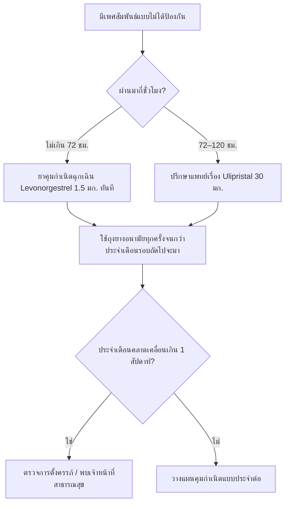

# ข้อสอบสุขศึกษา — ค่านิยมทางเพศ การคุมกำเนิด และโรคไม่ติดต่อเรื้อรัง

> [!abstract] สรุปในหนึ่งบรรทัด
> ชุดข้อสอบ 30 ข้อ (ปรนัย 4 ตัวเลือก) + ข้อเขียน 2 ข้อ ครอบคลุมสองเรื่องใหญ่: **ค่านิยมทางเพศและการคุมกำเนิด** (แบบเม็ดฮอร์โมนประจำ vs แบบฉุกเฉิน — ใช้อย่างไร ใช้แบบไหนในสถานการณ์ใด) และ **การเจ็บป่วย/การตายของคนไทยจากโรคไม่ติดต่อเรื้อรัง** (มะเร็ง เบาหวาน ความดัน หัวใจ — สาเหตุ อาการเตือน ป้องกัน)

## 🖼 ภาพประกอบ

<svg width="420" height="230" viewBox="0 0 420 230" xmlns="http://www.w3.org/2000/svg">
  <defs>
    <marker id="arrowEC" viewBox="0 0 10 10" refX="9" refY="5" markerWidth="6" markerHeight="6" orient="auto-start-reverse">
      <path d="M 0 0 L 10 5 L 0 10 z" fill="#333"/>
    </marker>
  </defs>
  <text x="10" y="18" font-size="13" font-weight="bold" fill="#333">กรอบเวลาใช้ยาคุมกำเนิดฉุกเฉิน</text>
  <text x="10" y="34" font-size="12" fill="#333">นับจากเวลาที่มีเพศสัมพันธ์แบบไม่ได้ป้องกัน</text>

  <!-- แท่ง Levonorgestrel 0-72 ชม -->
  <rect x="40" y="52" width="211" height="28" rx="6" fill="#4dabf7" fill-opacity="0.35" stroke="#1971c2" stroke-width="2"/>
  <text x="48" y="71" font-size="12" font-weight="bold" fill="#1864ab">Levonorgestrel 1.5 มก. (ภายใน 72 ชม.)</text>

  <!-- แท่ง Ulipristal 0-120 ชม -->
  <rect x="40" y="92" width="350" height="28" rx="6" fill="#ffd43b" fill-opacity="0.4" stroke="#f59f00" stroke-width="2"/>
  <text x="48" y="111" font-size="12" font-weight="bold" fill="#e67700">Ulipristal 30 มก. (ไม่เกิน 120 ชม.)</text>

  <!-- แกนเวลา -->
  <line x1="40" y1="150" x2="392" y2="150" stroke="#333" stroke-width="2" marker-end="url(#arrowEC)"/>
  <line x1="40" y1="145" x2="40" y2="155" stroke="#333" stroke-width="2"/>
  <line x1="110" y1="145" x2="110" y2="155" stroke="#333" stroke-width="2"/>
  <line x1="251" y1="145" x2="251" y2="155" stroke="#333" stroke-width="2"/>
  <line x1="390" y1="145" x2="390" y2="155" stroke="#333" stroke-width="2"/>
  <text x="40" y="172" font-size="12" fill="#333" text-anchor="middle">0</text>
  <text x="110" y="172" font-size="12" fill="#333" text-anchor="middle">24 ชม.</text>
  <text x="251" y="172" font-size="12" fill="#333" text-anchor="middle">72 ชม.</text>
  <text x="380" y="172" font-size="12" fill="#333" text-anchor="middle">120 ชม.</text>

  <text x="10" y="196" font-size="12" fill="#2f9e44">✓ ยิ่งกินเร็ว ประสิทธิภาพยิ่งสูง (ดีที่สุดภายใน 24 ชม. แรก)</text>
  <text x="10" y="214" font-size="12" fill="#e03131">✗ ไม่ใช่ยาคุมประจำ • ✗ ไม่ป้องกันโรคติดต่อทางเพศสัมพันธ์</text>
</svg>

<svg width="420" height="278" viewBox="0 0 420 278" xmlns="http://www.w3.org/2000/svg">
  <defs>
    <marker id="arrowNCD" viewBox="0 0 10 10" refX="9" refY="5" markerWidth="6" markerHeight="6" orient="auto-start-reverse">
      <path d="M 0 0 L 10 5 L 0 10 z" fill="#333"/>
    </marker>
  </defs>
  <text x="8" y="20" font-size="13" font-weight="bold" fill="#333">สี่ปัจจัยเสี่ยง → โรคไม่ติดต่อเรื้อรัง → แนวทางป้องกัน</text>

  <!-- ปัจจัยเสี่ยง -->
  <rect x="8" y="40" width="150" height="34" rx="8" fill="#4dabf7" fill-opacity="0.3" stroke="#1971c2" stroke-width="2"/>
  <text x="83" y="62" font-size="12" fill="#333" text-anchor="middle">สูบบุหรี่ / ยาสูบ</text>
  <rect x="8" y="85" width="150" height="34" rx="8" fill="#4dabf7" fill-opacity="0.3" stroke="#1971c2" stroke-width="2"/>
  <text x="83" y="107" font-size="12" fill="#333" text-anchor="middle">ดื่มแอลกอฮอล์</text>
  <rect x="8" y="130" width="150" height="34" rx="8" fill="#4dabf7" fill-opacity="0.3" stroke="#1971c2" stroke-width="2"/>
  <text x="83" y="152" font-size="12" fill="#333" text-anchor="middle">อาหารเค็ม หวาน มัน</text>
  <rect x="8" y="175" width="150" height="34" rx="8" fill="#4dabf7" fill-opacity="0.3" stroke="#1971c2" stroke-width="2"/>
  <text x="83" y="197" font-size="12" fill="#333" text-anchor="middle">ไม่ออกกำลังกาย</text>

  <!-- เส้นรวม -->
  <line x1="158" y1="57" x2="178" y2="57" stroke="#868e96" stroke-width="2"/>
  <line x1="158" y1="102" x2="178" y2="102" stroke="#868e96" stroke-width="2"/>
  <line x1="158" y1="147" x2="178" y2="147" stroke="#868e96" stroke-width="2"/>
  <line x1="158" y1="192" x2="178" y2="192" stroke="#868e96" stroke-width="2"/>
  <line x1="178" y1="57" x2="178" y2="192" stroke="#868e96" stroke-width="2"/>
  <line x1="178" y1="124" x2="188" y2="124" stroke="#333" stroke-width="2" marker-end="url(#arrowNCD)"/>

  <!-- โรค -->
  <rect x="190" y="74" width="132" height="100" rx="10" fill="#ff8787" fill-opacity="0.3" stroke="#e03131" stroke-width="2"/>
  <text x="256" y="100" font-size="12" font-weight="bold" fill="#c92a2a" text-anchor="middle">โรคไม่ติดต่อ</text>
  <text x="256" y="118" font-size="12" font-weight="bold" fill="#c92a2a" text-anchor="middle">เรื้อรัง (NCDs)</text>
  <text x="256" y="142" font-size="12" fill="#333" text-anchor="middle">มะเร็ง • เบาหวาน</text>
  <text x="256" y="160" font-size="12" fill="#333" text-anchor="middle">ความดัน • หัวใจ</text>

  <!-- ลูกศรลง -->
  <line x1="256" y1="174" x2="256" y2="210" stroke="#333" stroke-width="2" marker-end="url(#arrowNCD)"/>

  <!-- ป้องกัน -->
  <rect x="8" y="214" width="404" height="58" rx="10" fill="#69db7c" fill-opacity="0.3" stroke="#2f9e44" stroke-width="2"/>
  <text x="20" y="234" font-size="12" fill="#2b8a3e">กินผักผลไม้ • ลดเค็ม หวาน มัน • ไม่สูบบุหรี่</text>
  <text x="20" y="252" font-size="12" fill="#2b8a3e">ออกกำลังกาย 150 นาที/สัปดาห์ • ลดแอลกอฮอล์</text>
  <text x="20" y="268" font-size="12" fill="#2b8a3e">ตรวจสุขภาพประจำปี + ฉีดวัคซีน (HPV, ตับอักเสบบี)</text>
</svg>

> [!info] เกร็ดความรู้
> โรคไม่ติดต่อเรื้อรัง (non-communicable diseases, NCDs) เป็น**สาเหตุการตายอันดับต้นของคนไทย** — ประมาณ 3 ใน 4 ของการตายทั้งหมด และ WHO ตั้งเป้าลดการตายก่อนวัยอันควร (อายุ 30–69 ปี) ลง 1 ใน 3 ภายในปี 2030 (SDG 3.4)

---

## 🧠 สรุปเนื้อหาสำคัญก่อนทำข้อสอบ

### 1) คุมกำเนิดแบบประจำ vs แบบฉุกเฉิน

| ประเด็น | แบบเม็ดฮอร์โมน (ประจำ) | แบบฉุกเฉิน |
|---|---|---|
| ตัวอย่าง | ยาเม็ดคุมกำเนิดรวม (COC), มินิพิลล์ (ฮอร์โมนเดียว) | Levonorgestrel 1.5 มก., Ulipristal 30 มก. |
| ใช้เมื่อไร | กินทุกวันตามเวลา — เริ่มวันที่ 1–5 ของรอบเดือน | กิน**หลัง**มีเพศสัมพันธ์ไม่ป้องกัน เร็วที่สุด |
| กรอบเวลา | ทุกวัน ไม่มี "ข้ามวัน" | LNG ไม่เกิน 72 ชม. / UPA ไม่เกิน 120 ชม. |
| ประสิทธิภาพ | สูงมาก (~99%) ถ้ากินตรงเวลา | ลดลงตามเวลา (ดีที่สุดภายใน 24 ชม.) |
| ลักษณะ | วิธีคุมกำเนิดหลัก ใช้ต่อเนื่อง | **แผนสำรอง** ใช้เป็นครั้งคราวเท่านั้น |
| ป้องกันโรคติดต่อ | ไม่ได้ | ไม่ได้ (ต้องใช้ถุงยางอนามัยร่วม) |

**กลไกของยาคุมกำเนิดฉุกเฉิน** — ยับยั้งหรือชะลอการตกไข่ + ทำให้มูกที่ปากมดลูกข้นขึ้น จนอสุจิผ่านเข้าไปยากขึ้น **ไม่ได้ทำให้ตัวอ่อนที่ฝังตัวแล้วหลุด** จึงไม่ใช่ยาทำแท้ง

### 2) สถานการณ์ → ควรใช้แบบไหน

| สถานการณ์ | ทางเลือกที่เหมาะ |
|---|---|
| คุมกำเนิดต่อเนื่อง วางแผนระยะยาว | COC / มินิพิลล์ / ยาฉีด 3 เดือน / ยาฝัง / ห่วงอนามัย |
| ต้องป้องกันโรคติดต่อทางเพศสัมพันธ์ด้วย | **ถุงยางอนามัย** ทุกครั้ง (วิธีเดียวที่กันได้ทั้งท้องและโรค) |
| มีเพศสัมพันธ์ไม่ป้องกัน ภายใน 24 ชม. | ยาคุมกำเนิดฉุกเฉิน (LNG) ทันที — ยิ่งเร็ว ยิ่งดี |
| ผ่านมา 3–4 วัน (เกิน 72 ชม. แต่ไม่เกิน 120 ชม.) | ปรึกษาแพทย์เรื่อง Ulipristal 30 มก. |
| ใช้ยาฉุกเฉินบ่อย | เปลี่ยนมาใช้วิธีคุมกำเนิดประจำ + ปรึกษาหน่วยบริการ |
| ให้นมบุตร | มินิพิลล์/ยาฝัง หรือถุงยาง (ปรึกษาแพทย์) |
| ลืมกินยาเม็ดคุมกำเนิด | กินทันทีที่นึกได้ + ถุงยางสำรอง 7 วัน + พิจารณายาฉุกเฉิน |

### 3) โรคไม่ติดต่อเรื้อรัง — สาเหตุ อาการเตือน ป้องกัน

| โรค | สาเหตุ/ปัจจัยเสี่ยง | อาการเตือน | การป้องกัน |
|---|---|---|---|
| **มะเร็ง** | บุหรี่ แอลกอฮอล์ ไวรัส (HPV, ตับอักเสบบี/ซี) อาหารปิ้งย่างรมควัน กรรมพันธุ์ | น้ำหนักลดผิดปกติ ก้อนที่พบใหม่ เสียงแห้ง/ไอเป็นเลือดเกิน 3 สัปดาห์ เลือดออกผิดปกติ | ไม่สูบ ฉีดวัคซีน HPV และตับอักเสบบี กินผักผลไม้ คัดกรองตามวัย |
| **เบาหวาน** | น้ำหนักเกิน อ้วนลงพุง กรรมพันธุ์ กินหวาน/แป้งมาก ไม่ออกกำลังกาย | ปัสสาวะบ่อย กระหายน้ำ อ่อนเพลีย น้ำหนักลด แผลหายช้า ชาปลายมือปลายเท้า | คุมน้ำหนัก ลดหวาน/แป้งขัดขาว ออกกำลังกาย ตรวจน้ำตาลเป็นระยะ |
| **ความดันโลหิตสูง** | อาหารเค็มจัด แอลกอฮอล์ บุหรี่ อ้วน เครียด ขาดการออกกำลังกาย | ส่วนใหญ่มัก**ไม่มีอาการ** ("เพชฌฆาตเงียบ") บางรายปวดหัวท้ายทอย ใจสั่น | ลดโซเดียม (เกลือไม่เกิน 5 กรัม/วัน) กินผักผลไม้ ออกกำลังกาย ตรวจความดัน |
| **โรคหัวใจและหลอดเลือด** | ความดันสูง เบาหวาน ไขมันในเลือดสูง บุหรี่ อ้วน ความเครียด | เจ็บแน่นกลางอกนานเกิน 20 นาที ร้าวไปแขนซ้าย/กราม เหนื่อยง่าย เหงื่อออกผิดปกติ | คุมความดัน/เบาหวาน/ไขมัน เลิกบุหรี่ ออกกำลังกาย 150 นาที/สัปดาห์ |
| **โรคหลอดเลือดสมอง** | ความดันสูง เบาหวาน หัวใจเต้นผิดจังหวะ บุหรี่ | หน้าเบี้ยวแขนอ่อนแรง พูดไม่ชัด (FAST) → โทร 1669 ทันที | คุมความดัน กินผัก ลดเค็ม เลิกบุหรี่ ตรวจสุขภาพประจำปี |

> [!tip] ท่องให้ขึ้นใจ — 3อ. 2ส.
> **3อ.** = อาหาร (ผักผลไม้ ลดเค็ม หวาน มัน) • ออกกำลังกาย (150 นาที/สัปดาห์) • อารมณ์ (นอนพอ จัดการความเครียด) / **2ส.** = ไม่**ส**ูบบุหรี่ • ไม่**ส**ุรา

### 4) เกณฑ์ตัวเลขที่ต้องจำ

| เรื่อง | เกณฑ์ |
|---|---|
| ความดันปกติ | ต่ำกว่า 120/80 มม.ปรอท |
| วินิจฉัยความดันโลหิตสูง (เกณฑ์ไทย) | ตั้งแต่ 140/90 มม.ปรอท (เกณฑ์สากลใหม่ ≥ 130/80) |
| น้ำตาลในเลือดหลังอดอาหาร (FPG) ที่เข้าข่ายเบาหวาน | ตั้งแต่ 126 มก./ดล. |
| เกลือที่ควรกินสูงสุดต่อวัน | ไม่เกิน 5 กรัม (โซเดียมไม่เกิน 2,000 มก.) |
| ออกกำลังกายระดับปานกลาง | 150–300 นาที/สัปดาห์ |
| วัยที่ควรเริ่มฉีดวัคซีน HPV | 9–14 ปี (ก่อนเริ่มมีเพศสัมพันธ์) 2 เข็ม |

---

## 📝 ข้อสอบปรนัย 30 ข้อ

**คำชี้แจง:** เลือกคำตอบที่ถูกที่สุดเพียงข้อเดียว แล้วกดที่หัวข้อเพื่อดูเฉลย

### ส่วนที่ 1 · ค่านิยมทางเพศและการคุมกำเนิด (ข้อ 1–12)

> [!question]- 1 "ค่านิยมทางเพศ" หมายถึงข้อใด
> ก. กฎหมายที่กำหนดว่าอายุเท่าไรจึงมีเพศสัมพันธ์ได้
> ข. ความเชื่อและสิ่งที่เราเห็นคุณค่า ยึดถือเป็นแนวทางตัดสินใจเรื่องเพศของตนเอง
> ค. โรคที่เกิดจากการมีเพศสัมพันธ์ไม่ปลอดภัย
> ง. วิธีคุมกำเนิดที่มีประสิทธิภาพสูงสุด
> > [!success]- เฉลย
> > **ข้อ ข** — ค่านิยมคือสิ่งที่เราเห็นคุณค่าและใช้เป็นเข็มทิศตัดสินใจ (เช่น ความรับผิดชอบ การเคารพตัวเองและผู้อื่น) ไม่ใช่กฎหมายหรือวิธีคุมกำเนิด

> [!question]- 2 สิ่งสำคัญที่สุดก่อนตัดสินใจมีเพศสัมพันธ์กับคู่คือข้อใด
> ก. ซื้อถุงยางอนามัยเก็บไว้ให้พอก่อน
> ข. บอกเพื่อนสนิทว่าเราจะมีเพศสัมพันธ์
> ค. สื่อสารและตกลงร่วมกันกับคู่ด้วยความสมัครใจ
> ง. รอให้คู่เป็นฝ่ายขอก่อน
> > [!success]- เฉลย
> > **ข้อ ค** — หัวใจคือการยินยอม (consent) และการคุยกันอย่างตรงไปตรงมา ส่วนการเตรียมถุงยางสำคัญ แต่รองจากการตกลงร่วมกัน

> [!question]- 3 ข้อใดอธิบาย "การยินยอม (consent)" ถูกต้องที่สุด
> ก. การตกลงด้วยความสมัครใจ รู้สึกตัว และเปลี่ยนใจได้ทุกเมื่อ
> ข. การยอมตามคู่เพราะกลัวจะเสียคู่
> ค. การตกลงถ้าคู่สัญญาว่าจะไม่บอกใคร
> ง. การตกลงครั้งเดียวแล้วถือว่าใช้ได้ทุกครั้งต่อไป
> > [!success]- เฉลย
> > **ข้อ ก** — consent ต้องสมัครใจ ไม่ถูกกดดัน และ**ยกเลิกได้ตลอดเวลา** การยอมตามเพราะกลัวไม่ใช่ความยินยอม

> [!question]- 4 วิธีคุมกำเนิดใดป้องกันได้ทั้งการตั้งครรภ์และโรคติดต่อทางเพศสัมพันธ์
> ก. ยาเม็ดคุมกำเนิดรวม
> ข. ยาฉีดคุมกำเนิด
> ค. ห่วงอนามัย
> ง. ถุงยางอนามัย
> > [!success]- เฉลย
> > **ข้อ ง** — ถุงยางอนามัยเป็นวิธีเดียวในกลุ่มนี้ที่กัน**ทั้ง**การตั้งครรภ์และโรคติดต่อทางเพศสัมพันธ์ (HIV, หนองใน, ซิฟิลิส ฯลฯ) จึงควรใช้ร่วมกับวิธีอื่น

> [!question]- 5 ยาเม็ดคุมกำเนิดแบบฮอร์โมนรวม (COC) ที่มี 21 เม็ด วิธีใช้ที่ถูกต้องคือข้อใด
> ก. กินเมื่อมีเพศสัมพันธ์เท่านั้น
> ข. กินวันละ 1 เม็ด เวลาประมาณเดิมทุกวัน ต่อเนื่องตามแผง แล้วหยุด 7 วันก่อนเริ่มแผงใหม่
> ค. กินวันละ 2 เม็ดเช้า–เย็น ทุกวัน
> ง. กินสัปดาห์ละ 1 เม็ด
> > [!success]- เฉลย
> > **ข้อ ข** — ต้องกิน**ทุกวันเวลาเดิม** ห้ามลืม กินครบ 21 เม็ดแล้วเว้น 7 วัน (หรือใช้แบบ 24/4 ตามฉลาก) ประสิทธิภาพจะดีมากถ้ากินตรงเวลา

> [!question]- 6 ถ้าลืมกินยาเม็ดคุมกำเนิดเกิน 2 วัน ควรทำอย่างไร
> ก. หยุดกินยาไปเลย แล้วเริ่มแผงใหม่เดือนหน้า
> ข. กินยาชดเชยทันทีที่ระลึกได้ + ใช้ถุงยางอนามัยสำรองอย่างน้อย 7 วัน และถ้ามีเพศสัมพันธ์ไม่ป้องกันในช่วง 5 วันที่ผ่านมา ให้ปรึกษาเรื่องยาคุมกำเนิดฉุกเฉิน
> ค. กินยาเพิ่มเป็น 2 เท่าทุกวันจนหมดแผง
> ง. ไม่ต้องทำอะไร รอประจำเดือนรอบถัดไป
> > [!success]- เฉลย
> > **ข้อ ข** — เมื่อระดับฮอร์โมนขาดช่วง ไข่อาจตกได้ ต้องกินชดเชย + ป้องกันสำรอง + พิจารณายาฉุกเฉิน (ไม่ต้องเพิ่มขนาดยาเอง)

> [!question]- 7 ยาเม็ดคุมกำเนิดแบบฮอร์โมนเดียว (มินิพิลล์) แตกต่างจากแบบรวมตรงข้อใด
> ก. กินเวลาเดิม ห่างได้ไม่เกิน 3 ชั่วโมง จึงต้องตรงเวลามากกว่า
> ข. กินเฉพาะวันที่มีเพศสัมพันธ์
> ค. กินได้ถึง 120 ชั่วโมงหลังมีเพศสัมพันธ์
> ง. ป้องกันโรคติดต่อทางเพศสัมพันธ์ได้
> > [!success]- เฉลย
> > **ข้อ ก** — มินิพิลล์ต้องตรงเวลามาก (ห่างไม่เกิน 3 ชม. บางชนิดเช่น desogestrel ได้ถึง 12 ชม.) แต่เป็นตัวเลือกที่ดีสำหรับแม่ให้นมบุตร

> [!question]- 8 ยาคุมกำเนิดฉุกเฉิน Levonorgestrel 1.5 มก. มีประสิทธิภาพสูงสุดเมื่อใช้ภายในกี่ชั่วโมง
> ก. 12 ชั่วโมง
> ข. 24 ชั่วโมง
> ค. 72 ชั่วโมง
> ง. 120 ชั่วโมง
> > [!success]- เฉลย
> > **ข้อ ข** — ใช้ได้ไม่เกิน 72 ชม. แต่**ภายใน 24 ชม. แรก**ได้ผลดีที่สุด (ลดโอกาสตั้งครรภ์ได้ราว 95% ของที่ควรลด) ยิ่งช้ายิ่งลดลง

> [!question]- 9 ยาคุมกำเนิดฉุกเฉินชนิดใดใช้ได้ถึง 120 ชั่วโมง (5 วัน)
> ก. Levonorgestrel 1.5 มก.
> ข. Ulipristal acetate 30 มก.
> ค. สูตร Yuzpe
> ง. มินิพิลล์
> > [!success]- เฉลย
> > **ข้อ ข** — Ulipristal 30 มก. ใช้ได้ถึง 120 ชม. และยังคงประสิทธิภาพได้ดีในวันที่ 3–5 (ต้องปรึกษาแพทย์/เภสัชกร) ส่วนสูตร Yuzpe เลิกแนะนำแล้วเพราะได้ผลน้อยกว่าและผลข้างเคียงมากกว่า

> [!question]- 10 ข้อใดอธิบายกลไกของยาคุมกำเนิดฉุกเฉินได้ถูกต้อง
> ก. ทำให้ตัวอ่อนที่ฝังตัวแล้วหลุดออกมา
> ข. ยับยั้ง/ชะลอการตกไข่ และทำให้มูกที่ปากมดลูกข้นขึ้น
> ค. ฆ่าอสุจิทันทีหลังมีเพศสัมพันธ์
> ง. ป้องกันโรคติดต่อทางเพศสัมพันธ์ทุกชนิด
> > [!success]- เฉลย
> > **ข้อ ข** — กลไกหลักคือชะลอการตกไข่ (ไม่ใช่ยาทำแท้ง) จึงไม่ป้องกันโรคติดต่อ และไม่ช่วยถ้าตัวอ่อนฝังตัวแล้ว

> [!question]- 11 ข้อใดกล่าวถึงยาคุมกำเนิดฉุกเฉิน**ผิด**
> ก. ใช้เป็นแผนสำรอง ไม่ใช่ยาคุมประจำ
> ข. อาจมีเลือดออกกะปริดกะปรอย และประจำเดือนรอบถัดไปคลาดเคลื่อนได้
> ค. ใช้เป็นวิธีคุมกำเนิดประจำทุกเดือนได้ เพราะสะดวก
> ง. ควรตรวจการตั้งครรภ์ถ้าประจำเดือนช้าเกิน 1 สัปดาห์
> > [!success]- เฉลย
> > **ข้อ ค** — ยาฉุกเฉินไม่ใช่ยาคุมประจำ ประสิทธิภาพต่ำกว่าวิธีประจำมาก และใช้บ่อยจะทำให้รอบเดือนปั่นป่วน ควรเปลี่ยนไปใช้วิธีประจำแทน

> [!question]- 12 สถานการณ์ — เพื่อนของนางสาวก้อยมีเพศสัมพันธ์แบบไม่ได้ป้องกันเมื่อ 30 ชั่วโมงที่แล้ว ข้อแนะนำใดเหมาะสมที่สุด
> ก. รอจนครบ 72 ชั่วโมงก่อนจึงกินยา
> ข. รีบซื้อยาคุมกำเนิดฉุกเฉิน Levonorgestrel 1.5 มก. มากินทันทีที่ทำได้ พร้อมเตรียมตรวจการตั้งครรภ์ถ้าประจำเดือนช้า
> ค. กินน้ำอัดลมมาก ๆ แล้วรอประจำเดือนมา
> ง. กินยาปฏิชีวนะเพื่อฆ่าเชื้อ
> > [!success]- เฉลย
> > **ข้อ ข** — อยู่ในช่วง 72 ชม. และเร็วกว่าดีกว่าเสมอ ต้องคุมด้วยถุงยางจนกว่าประจำเดือนรอบถัดไปจะมา แล้วตรวจการตั้งครรภ์ถ้าคลาดเคลื่อนเกิน 1 สัปดาห์

### ส่วนที่ 2 · โรคไม่ติดต่อเรื้อรังของคนไทย (ข้อ 13–26)

> [!question]- 13 โรคไม่ติดต่อเรื้อรัง (NCDs) มีลักษณะสำคัญตามข้อใด
> ก. ติดต่อจากคนหนึ่งไปอีกคนหนึ่งได้ง่าย
> ข. เกิดจากเชื้อโรคเป็นหลัก รักษาหายได้เร็วด้วยยาปฏิชีวนะ
> ค. เกิดจากพฤติกรรมและพันธุกรรม ใช้เวลานานกว่าจะแสดงอาการ และมักต้องดูแลต่อเนื่อง
> ง. เกิดเฉพาะกับคนอายุมากกว่า 80 ปี
> > [!success]- เฉลย
> > **ข้อ ค** — NCDs ไม่แพร่จากคนสู่คน เป็นโรคเรื้อรังที่ต้องดูแลระยะยาว และปัจจุบันพบในคนอายุน้อยลงเรื่อย ๆ เช่น เบาหวานชนิดที่ 2 ในวัยรุ่น

> [!question]- 14 ปัจจัยเสี่ยงหลัก 4 อย่างของโรคไม่ติดต่อเรื้อรังตามองค์การอนามัยโลกคือข้อใด
> ก. ยาสูบ แอลกอฮอล์ อาหารที่ไม่ดีต่อสุขภาพ ขาดกิจกรรมทางกาย
> ข. ฝุ่น PM2.5 น้ำท่วม อากาศร้อน ยุงลาย
> ค. เชื้อไวรัส แบคทีเรีย พยาธิ เชื้อรา
> ง. กรรมพันธุ์อย่างเดียว
> > [!success]- เฉลย
> > **ข้อ ก** — ทั้ง 4 อย่างนี้ปรับได้ด้วยพฤติกรรมของเราเอง (กรรมพันธุ์เป็นปัจจัยเสี่ยงเพิ่ม แต่ไม่ใช่ 1 ใน 4 ของ WHO)

> [!question]- 15 กลุ่มโรคใดเป็นสาเหตุการตายอันดับต้น ๆ ของคนไทยในปัจจุบัน
> ก. โรคติดเชื้อทางเดินหายใจและท้องเสีย
> ข. โรคไม่ติดต่อเรื้อรัง เช่น มะเร็ง โรคหัวใจ โรคหลอดเลือดสมอง
> ค. โรคไข้เลือดออกและมาลาเรีย
> ง. โรคขาดสารอาหาร
> > [!success]- เฉลย
> > **ข้อ ข** — ประเทศไทยเปลี่ยนผ่านสู่สังคมโรคไม่ติดต่อเรื้อรังแล้ว ประมาณ 3 ใน 4 ของการตายทั้งหมดมาจากกลุ่ม NCDs

> [!question]- 16 อาการคลาสสิกที่ชี้ว่าอาจเป็นโรคเบาหวานคือข้อใด
> ก. ปัสสาวะบ่อย กระหายน้ำมาก น้ำหนักลดลงโดยไม่ตั้งใจ
> ข. หน้าเบี้ยว แขนขาอ่อนแรง พูดไม่ชัด
> ค. เจ็บแน่นหน้าอกนานเกิน 20 นาที
> ง. หายใจหอบตอนออกกำลังกาย
> > [!success]- เฉลย
> > **ข้อ ก** — รวมถึงอ่อนเพลีย หิวบ่อย แผลหายช้าและชาปลายเท้า (ข้อ ข คือโรคหลอดเลือดสมอง ข้อ ค คือกล้ามเนื้อหัวใจขาดเลือด)

> [!question]- 17 โรคความดันโลหิตสูงถูกเรียกว่า "เพชฌฆาตเงียบ" (silent killer) เพราะเหตุใด
> ก. ติดต่อทางอากาศโดยไม่มีอาการ
> ข. มักไม่มีอาการชัดเจน แต่ทำลายหลอดเลือด หัวใจ สมอง และไตไปเรื่อย ๆ
> ค. รักษาไม่หายและมีอาการรุนแรงตั้งแต่วันแรก
> ง. เกิดเฉพาะเวลานอนหลับ
> > [!success]- เฉลย
> > **ข้อ ข** — คนส่วนใหญ่ไม่รู้ตัวจนกว่าจะเกิดภาวะแทรกซ้อน การตรวจความดันเป็นระยะจึงสำคัญมาก

> [!question]- 18 ค่าความดันโลหิตเท่าไรที่เริ่มวินิจฉัยว่าเป็น "ความดันโลหิตสูง" ตามเกณฑ์ของไทย
> ก. ตั้งแต่ 110/70 มม.ปรอท
> ข. ตั้งแต่ 120/80 มม.ปรอท
> ค. ตั้งแต่ 140/90 มม.ปรอท
> ง. ตั้งแต่ 170/100 มม.ปรอท
> > [!success]- เฉลย
> > **ข้อ ค** — เกณฑ์ไทยใช้ 140/90 มม.ปรอท (เกณฑ์สากลใหม่บางสมาคมใช้ 130/80) ส่วน 120/80 คือค่าปกติ

> [!question]- 19 อาการใดเป็นสัญญาณ "กล้ามเนื้อหัวใจขาดเลือดเฉียบพลัน" ที่ต้องไปโรงพยาบาลทันที
> ก. ปวดเข่ามากหลังเล่นกีฬา
> ข. เจ็บแน่นกลางอกนานเกิน 20 นาที ร้าวไปแขนซ้ายหรือกราม เหงื่อออก ใจสั่น
> ค. คันตามผิวหนัง
> ง. ปวดข้อนิ้วตอนเช้า
> > [!success]- เฉลย
> > **ข้อ ข** — ห้ามขับรถเอง ให้โทรศัพท์แจ้งเหตุฉุกเฉิน **1669** ทันที เพราะทุกนาทีที่หลอดเลือดอุดตันคือกล้ามเนื้อหัวใจที่ตาย

> [!question]- 20 โรคหลอดเลือดสมอง (stroke) ใช้หลัก "FAST" ตรวจสอบ ข้อใดถูกต้องที่สุด
> ก. F = หน้าเบี้ยว A = แขนอ่อนแรง S = พูดไม่ชัด T = โทร 1669 ทันที
> ข. F = กินยา A = วัดความดัน S = นอนพัก T = ซื้อยากินเอง
> ค. F = ปวดหัว A = อาเจียน S = ตาแดง T = นอนหลับ
> ง. F = ตัวสั่น A = เจ็บเข่า S = ไอ T = รอพรุ่งนี้ค่อยไปหาหมอ
> > [!success]- เฉลย
> > **ข้อ ก** — Thrombolysis ต้องให้ภายใน "หน้าต่างทองคำ" ประมาณ 4.5 ชั่วโมง ยิ่งเร็วสมองยิ่งเสียหายน้อย

> [!question]- 21 ข้อใดเป็น "อาการเตือนมะเร็ง" ที่ควรพบแพทย์ตรวจทันที
> ก. เป็นหวัดบ่อย 2 สัปดาห์แล้วหายเอง
> ข. น้ำหนักลดลงมากโดยไม่ตั้งใจ หรือมีก้อนที่พบใหม่และโตขึ้น
> ค. เจ็บกล้ามเนื้อหลังออกกำลังกายครั้งแรก
> ง. ปวดข้อเมื่ออากาศเย็น
> > [!success]- เฉลย
> > **ข้อ ข** — อาการเตือนอื่น ๆ เช่น ไอเป็นเลือดหรือเสียงแห้งเกิน 3 สัปดาห์ เลือดออกผิดปกติ ท้องผูกสลับท้องเสีย กลืนอาหารลำบาก ฝ้าที่ผิวหรือในปาก

> [!question]- 22 มะเร็งปากมดลูกป้องกันได้อย่างไร
> ก. ฉีดวัคซีน HPV และเข้ารับการตรวจคัดกรองมะเร็งปากมดลูกตามวัย
> ข. ดื่มวิตามิน C ทุกวัน
> ค. ออกกำลังกายเพื่อให้กล้ามเนื้อเชิงกรานแข็งแรง
> ง. ตรวจมะเร็งเต้านมด้วยการเอ็กซ์เรย์ปอด
> > [!success]- เฉลย
> > **ข้อ ก** — วัคซีน HPV ฉีดในวัย 9–14 ปีได้ผลดีที่สุด + การคัดกรอง (แปปสเมียร์/ตรวจ HPV) คือการป้องกันสองชั้นที่มีประสิทธิภาพสูงมาก

> [!question]- 23 การฉีดวัคซีนใดช่วยลดความเสี่ยงมะเร็งตับได้
> ก. วัคซีนไข้หวัดใหญ่
> ข. วัคซีนไวรัสตับอักเสบบี
> ค. วัคซีนหวัดนก
> ง. วัคซีนงูสวัด
> > [!success]- เฉลย
> > **ข้อ ข** — ไวรัสตับอักเสบบีและซีเป็นสาเหตุสำคัญของมะเร็งตับในไทย ควรฉีดวัคซีนตั้งแต่แรกเกิดและหลีกเลี่ยงการดื่มแอลกอฮอล์

> [!question]- 24 ปริมาณเกลือที่องค์การอนามัยโลกแนะนำให้กินไม่เกินในแต่ละวัน และออกกำลังกายที่แนะนำคือข้อใด
> ก. เกลือไม่เกิน 5 กรัม/วัน และออกกำลังกาย 150 นาที/สัปดาห์
> ข. เกลือไม่เกิน 15 กรัม/วัน และออกกำลังกาย 30 นาที/เดือน
> ค. เกลือไม่เกิน 1 กรัม/วัน และออกกำลังกายวันละ 5 ชั่วโมง
> ง. ไม่จำกัดเกลือ แต่ต้องดื่มน้ำ 8 แก้ว
> > [!success]- เฉลย
> > **ข้อ ก** — เกลือไม่เกิน 5 กรัม (โซเดียมไม่เกิน 2,000 มก.) และขยับร่างกายระดับปานกลาง 150–300 นาที/สัปดาห์

> [!question]- 25 ข้อใด**ไม่ใช่**ปัจจัยเสี่ยงของโรคไม่ติดต่อเรื้อรัง
> ก. กรรมพันธุ์
> ข. การสูบบุหรี่
> ค. การติดเชื้อหวัดจากเพื่อนในห้องเรียน
> ง. การไม่ออกกำลังกาย
> > [!success]- เฉลย
> > **ข้อ ค** — โรคหวัดเป็นโรคติดเชื้อ ไม่ใช่ NCDs ส่วนข้ออื่นเป็นปัจจัยเสี่ยงที่เพิ่มโอกาสเป็นมะเร็ง เบาหวาน ความดัน และโรคหัวใจ

> [!question]- 26 การตรวจสุขภาพประจำปีมีความสำคัญต่อโรคไม่ติดต่อเรื้อรังอย่างไร
> ก. ช่วยรักษาโรคให้หายขาดทันที
> ข. ช่วยตรวจพบโรคตั้งแต่ระยะเริ่มต้นหรือระยะก่อนโรค เพื่อแก้ไขได้ทัน
> ค. ช่วยให้ไม่ต้องออกกำลังกาย
> ง. ใช้แทนการฉีดวัคซีนได้
> > > [!success]- เฉลย
> > **ข้อ ข** — เบาหวานและความดันระยะแรกมักไม่มีอาการ ถ้าตรวจพบเร็วจะปรับพฤติกรรม/รักษาได้ก่อนอวัยวะถูกทำลาย

### ส่วนที่ 3 · บูรณาการและป้องกันโรค (ข้อ 27–30)

> [!question]- 27 การปฏิบัติตามหลัก "3อ. 2ส." ข้อใดถูกต้อง
> ก. อาหาร ออกกำลังกาย อารมณ์ — ไม่สูบบุหรี่ ไม่ดื่มสุรา
> ข. อาหาร อากาศ อารมณ์ — สูบบุหรี่ สังสรรค์
> ค. อาหาร สุขภาพ ออกกำลังกาย — สอบ สอบ สอบ
> ง. อาหาร ออกกำลังกาย อิจฉา — สูบ สุรา
> > [!success]- เฉลย
> > **ข้อ ก** — เป็นหลักที่กระทรวงสาธารณสุขใช้รณรงค์ ลดความเสี่ยงโรคไม่ติดต่อเรื้อรังได้ครบทั้ง 4 ปัจจัยหลัก

> [!question]- 28 ถ้าคนในครอบครัวเป็นทั้งเบาหวานและความดัน สิ่งที่ควรเริ่มทำเป็นอันดับแรกคือข้อใด
> ก. ซื้อยากินเองตามเพื่อนบ้าน
> ข. ปรับอาหาร ลดเค็ม/หวาน/มัน ออกกำลังกายสม่ำเสมอ และตรวจสุขภาพตามนัดอย่างต่อเนื่อง
> ค. งดอาหารทุกชนิดเพื่อให้หิวน้อยลง
> ง. หลีกเลี่ยงการพบแพทย์เพื่อไม่ให้เครียด
> > > [!success]- เฉลย
> > **ข้อ ข** — หัวใจคือ "ปรับพฤติกรรม + พบแพทย์สม่ำเสมอ + กินยาต่อเนื่อง" ไม่หยุดยาเองแม้อาการจะดีขึ้น เพราะโรคนี้มักไม่มีอาการเตือน

> [!question]- 29 ถ้าเห็นคุณตาลุกขึ้นแล้วหน้าเบี้ยว พูดไม่ชัด แขนข้างหนึ่งอ่อนแรง ควรทำอะไรก่อนเป็นอันดับแรก
> ก. ป้อนน้ำและยาแก้ปวด
> ข. นวดแขนขาให้คลาย แล้วนอนพักต่อ
> ค. โทร 1669 แจ้งเหตุฉุกเฉินทันที และจดเวลาที่เริ่มมีอาการ
> ง. ถ่ายรูปส่งให้ญาติก่อนตัดสินใจ
> > > [!success]- เฉลย
> > **ข้อ ค** — "เวลา" คือสมอง ทุกนาทีที่รอทำให้โอกาสหายกลับมาใช้อวัยวะได้ลดลง ห้ามป้อนน้ำ/อาหารเพราะเสี่ยงสำลัก

> [!question]- 30 ข้อใดกล่าวเกี่ยวกับโรคไม่ติดต่อเรื้อรัง**ผิด**
> ก. พบได้ในคนอายุน้อยได้ เช่น เบาหวานชนิดที่ 2 ในวัยรุ่นที่อ้วน
> ข. ปัจจัยเสี่ยงส่วนใหญ่ปรับเปลี่ยนได้ด้วยพฤติกรรมของเรา
> ค. เกิดขึ้นเฉพาะผู้สูงอายุเท่านั้น
> ง. การตรวจสุขภาพช่วยจับโรคได้ตั้งแต่ระยะแรก
> > > [!success]- เฉลย
> > **ข้อ ค** — NCDs พบในคนหนุ่มสาวได้มากขึ้นเรื่อย ๆ จากการกินอาหารฟาสต์ฟู้ด น้ำหวาน นั่งเล่นมือถือทั้งวัน และไม่ออกกำลังกาย

---

## ✍️ ข้อสอบข้อเขียน 2 ข้อ

> [!tip] เทคนิคตอบข้อเขียนให้ได้คะแนน
> ใช้โครง **"บอกหลัก–ยกตัวอย่าง–บอกผลลัพธ์"** ทุกย่อหน้า: เปิดด้วยค่านิยม/หลักการ → ยกตัวอย่างสถานการณ์จริงใกล้ตัว → ปิดด้วยผลที่ได้ อย่าลืมเขียนหัวข้อย่อยและตัวเลข/เกณฑ์สำคัญ ๆ (เช่น 150 นาที/สัปดาห์, ไม่เกิน 5 กรัม/วัน, 1669)

### ข้อเขียนข้อ 1 (5 คะแนน) — ค่านิยมทางเพศที่นำมาปรับใช้

**คำถาม:** ให้นักเรียนเลือก**ค่านิยมทางเพศ 2–3 ข้อ** ที่ตนนำมาปรับใช้ในชีวิตประจำวัน อธิบายว่าค่านิยมเหล่านั้นใช้อย่างไรในสถานการณ์จริง และถ้าในการสัมภาษณ์งานหรือการพูดคุยกับผู้ใหญ่มีคำถามเรื่องการรับผิดชอบต่อเรื่องเพศ นักเรียนจะตอบอย่างไร

> [!question]- แนวทางการตอบ
> > [!success]- แนวคำตอบตัวอย่าง (เกณฑ์ 5 คะแนน)
> > **ค่านิยมที่เลือก (2 คะแนน – เขียน 2–3 ข้อ):**
> > 1. **ความยินยอม (consent)** — การมีเพศสัมพันธ์ต้องมาจากความสมัครใจของทั้งสองฝ่าย ไม่กดดัน ไม่ใช้ความเมาเป็นข้ออ้าง และเปลี่ยนใจได้ทุกเมื่อ
> > 2. **ความรับผิดชอบร่วมกัน** — ทั้งสองฝ่ายร่วมกันวางแผนคุมกำเนิดและป้องกันโรค ไม่โยนภาระให้ฝ่ายใดฝ่ายหนึ่ง
> > 3. **การเห็นคุณค่าในตัวเองและไม่ตัดสินผู้อื่น** — ไม่กดดันตัวเองให้ทำตามเพื่อน และไม่นำเรื่องเพศของผู้อื่นไปนินทา
> >
> > **ตัวอย่างการนำไปใช้ (2 คะแนน):** สมมติคู่ชวนมีเพศสัมพันธ์โดยยังไม่มีถุงยาง — เราเลือกที่จะบอกหยุดและคุยกันตรง ๆ ว่า "ถ้ายังไม่มีวิธีป้องกัน เรายังไม่พร้อม" แล้วช่วยกันหาวิธีที่ปลอดภัย เช่น ใช้ถุงยาง และวางแผนไปปรึกษาหน่วยบริการเรื่องวิธีคุมกำเนิดประจำ (ยาเม็ดฮอร์โมน/ยาฉีด) เพราะฉุกเฉินใช้เป็นแผนสำรองเท่านั้น และไม่ลืมว่าใช้ยาฉุกเฉินไม่ป้องกันโรคติดต่อ
> >
> > **ตัวอย่างคำตอบในสถานการณ์สัมภาษณ์ (1 คะแนน):** "ผม/หนู ใช้หลักความยินยอมและความรับผิดชอบครับ/ค่ะ — ทุกการตัดสินใจเรื่องเพศต้องมาจากความสมัครใจ และต้องป้องกันตัวเองด้วยวิธีที่เหมาะกับสถานการณ์ เช่น ถุงยางอนามัยทุกครั้ง และถ้าเกิดเหตุไม่คาดคิดก็รู้ว่ามีทางเลือกคือยาคุมกำเนิดฉุกเฉินภายใน 72 ชั่วโมง พร้อมที่จะพาคู่ไปพบเจ้าหน้าที่สาธารณสุข ไม่ตัดสินใจแก้ปัญหาเองแบบผิด ๆ"
> >
> > **เกณฑ์ให้คะแนน:** ระบุค่านิยมชัดเจน 2–3 ข้อ (2) • ยกตัวอย่างสถานการณ์จริง สมเหตุสมผล (2) • เรียบเรียงเป็นระบบ ใช้ภาษาเหมาะสมและตอบโจทย์สถานการณ์สัมภาษณ์ (1)

### ข้อเขียนข้อ 2 (5 คะแนน) — การป้องกันโรคไม่ติดต่อเรื้อรัง

**คำถาม:** โรคไม่ติดต่อเรื้อรัง (มะเร็ง เบาหวาน ความดันโลหิตสูง โรคหัวใจ) มีสาเหตุและอาการเตือนอย่างไร และนักเรียนจะป้องกันโรคเหล่านี้ให้กับตนเองและคนในครอบครัวอย่างไร

> [!question]- แนวทางการตอบ
> > [!success]- แนวคำตอบตัวอย่าง (เกณฑ์ 5 คะแนน)
> > **สาเหตุ (2 คะแนน):** เกิดจากพฤติกรรมเป็นหลัก — สูบบุหรี่ ดื่มแอลกอฮอล์ กินอาหารเค็มจัด/หวาน/มัน ไม่ออกกำลังกาย น้ำหนักเกิน อ้วนลงพุง เครียดสะสม ร่วมกับพันธุกรรมและอายุที่เพิ่มขึ้น
> >
> > **อาการเตือนที่ต้องรู้ (1.5 คะแนน):**
> > - เบาหวาน — ปัสสาวะบ่อย กระหายน้ำ น้ำหนักลด แผลหายช้า ชาปลายเท้า
> > - ความดันสูง — มักไม่มีอาการ (เพชฌฆาตเงียบ) บางรายปวดหัวท้ายทอย ใจสั่น
> > - โรคหัวใจ — เจ็บแน่นหน้าอกนานเกิน 20 นาที ร้าวไปแขนซ้าย/กราม เหงื่อออก (โทร 1669)
> > - มะเร็ง — น้ำหนักลดผิดปกติ มีก้อนใหม่ ไอเป็นเลือด/เสียงแห้งเกิน 3 สัปดาห์ เลือดออกผิดปกติ
> >
> > **แนวทางป้องกัน (1.5 คะแนน):**
> > - ระดับตัวเอง — หลัก 3อ. 2ส.: กินผักผลไม้วันละ 400 กรัม ลดเกลือไม่เกิน 5 กรัม/วัน ออกกำลังกาย 150 นาที/สัปดาห์ ไม่สูบบุหรี่ ไม่ดื่มสุรา นอนพอ จัดการความเครียด
> > - ระดับครอบครัว — ชวนกันทำอาหารกินเองแบบลดเค็ม/หวาน ชวนกันเดิน–วิ่ง–ปั่นจักรยาน ตรวจสุขภาพประจำปีด้วยกัน วัดความดันที่บ้านเป็นประจำ และเตือนให้พ่อแม่/ญาติกินยาต่อเนื่องโดยไม่หยุดเอง
> > - ระดับสังคม — เข้าร่วมรณรงค์ของโรงเรียน/ชุมชน ตรวจคัดกรองตามวัย (มะเร็งปากมดลูก เต้านม ลำไส้ใหญ่) และฉีดวัคซีน HPV + ไวรัสตับอักเสบบี
> >
> > **เกณฑ์ให้คะแนน:** อธิบายสาเหตุและอาการเตือนของโรคได้ถูกต้อง (2) • เสนอแนวทางป้องกันครบทั้งตัวเองและครอบครัว (2) • ใช้ข้อมูล/ตัวเลขอ้างอิงถูกต้องและเรียงลำดับอ่านเข้าใจ (1)

---

## ⚠️ ข้อควรระวัง

> [!warning] ข้อผิดพลาดที่พบบ่อยในการทำข้อสอบชุดนี้
> 1. **สลับ "ยาคุมประจำ" กับ "ยาคุมฉุกเฉิน"** — ยาเม็ดฮอร์โมน (COC/มินิพิลล์) กินทุกวันเวลาเดิมเป็นวิธี **ประจำ** ส่วนยาฉุกเฉินใช้ **หลัง**เหตุการณ์เท่านั้นและเป็นแค่แผนสำรอง
> 2. **จำกรอบเวลาผิด** — Levonorgestrel = 72 ชม. / Ulipristal = 120 ชม. ตัวเลขนี้ต้องแม่น และ "ยิ่งเร็วยิ่งดี" เสมอ
> 3. **คิดว่ายาคุมฉุกเฉินทำให้แท้งได้** — ไม่ใช่ กลไกหลักคือชะลอการตกไข่ ถ้าตัวอ่อนฝังตัวแล้วจะไม่ช่วย
> 4. **คิดว่ายาคุมเม็ดหรือยาฉีดกันโรคติดต่อได้** — ไม่ได้! วิธีที่กันได้ทั้งสองอย่างคือ **ถุงยางอนามัย**
> 5. **คิดว่าโรคไม่ติดต่อเรื้อรังเป็นเรื่องของผู้สูงอายุ** — เบาหวานชนิดที่ 2 พบในวัยรุ่นที่อ้วนได้ และความดันสูงก็เป็นแบบ "ไม่มีอาการ"
> 6. **ดูถูกอาการ "ไม่มีอาการ"** — โรคความดัน เบาหวาน และไขมันในเลือดสูงมักเงียบสนิท ต้องพึ่งการตรวจสุขภาพ ไม่ใช่ความรู้สึก
> 7. **จำสลับตัวเลขสำคัญ** — เกลือไม่เกิน 5 กรัม/วัน (โซเดียมไม่เกิน 2,000 มก.), ออกกำลังกาย 150 นาที/สัปดาห์, เบาหวานเริ่ม 126 มก./ดล., ความดันสูงเริ่ม 140/90 (เกณฑ์ไทย), เบอร์ฉุกเฉิน 1669

## 🎴 การ์ดทบทวน #flashcards

ยาคุมกำเนิดฉุกเฉินชนิด Levonorgestrel 1.5 มก. ใช้ภายในกี่ชั่วโมง?::ไม่เกิน 72 ชั่วโมง (ยิ่งเร็วยิ่งดี ดีที่สุดภายใน 24 ชม. แรก)

ยาคุมกำเนิดฉุกเฉินชนิดใดใช้ได้ถึง 120 ชั่วโมง?::Ulipristal acetate 30 มก. (ปรึกษาแพทย์/เภสัชกร)

วิธีคุมกำเนิดใดป้องกันได้ทั้งการตั้งครรภ์และโรคติดต่อทางเพศสัมพันธ์?::ถุงยางอนามัย (ใช้ถูกต้องทุกครั้ง)

การยินยอม (consent) ในเรื่องเพศหมายถึงอะไร?::การตกลงด้วยความสมัครใจ รู้สึกตัว และเปลี่ยนใจได้ทุกเมื่อ ไม่ถูกกดดัน

ปัจจัยเสี่ยงหลัก 4 อย่างของโรคไม่ติดต่อเรื้อรังตาม WHO?::ยาสูบ • แอลกอฮอล์ • อาหารไม่ดีต่อสุขภาพ • ขาดกิจกรรมทางกาย

โรคไม่ติดต่อเรื้อรังคิดเป็นสัดส่วนเท่าไรของการตายทั้งหมดในไทย?::ประมาณ 3 ใน 4 (ข้อมูลองค์การอนามัยโลก) — เป็นสาเหตุการตายอันดับต้น ๆ

เกณฑ์วินิจฉัยความดันโลหิตสูงตามเกณฑ์ไทย?::ตั้งแต่ 140/90 มม.ปรอท (ปกติต่ำกว่า 120/80)

เกลือและเวลาออกกำลังกายที่ WHO แนะนำต่อวัน/สัปดาห์?::เกลือไม่เกิน 5 กรัม/วัน และออกกำลังกายปานกลาง 150–300 นาที/สัปดาห์

อาการเตือนมะเร็งที่ต้องพบแพทย์ทันที?::น้ำหนักลดผิดปกติ มีก้อนใหม่ ไอเป็นเลือดหรือเสียงแห้งเกิน 3 สัปดาห์ เลือดออกผิดปกติ

โรคหลอดเลือดสมองสงสัยได้จากหลักใด และโทรเบอร์อะไร?::FAST — หน้าเบี้ยว (Face) แขนอ่อนแรง (Arm) พูดไม่ชัด (Speech) แล้วโทร 1669 ทันที (Time)

## 🔗 หัวข้อที่เกี่ยวข้อง

- [[ตารางทบทวนสอบปลายภาค 1-2569]] — สุขศึกษาสอบวันจันทร์ที่ 21 ก.ย. (09.40–10.20) อยู่ในแผนนี้
- [[ตรีโกณมิติเบื้องต้น]] — ตัวอย่างการใช้สัดส่วนช่วยคำนวณในวิชาวิทยาศาสตร์สุขภาพ
- [[เซลล์กัลวานิก]] — แนวทางการอ่านโน้ตวิทยาศาสตร์ให้เข้าใจเร็วแบบเดียวกัน (เรียบเรียงเป็นตาราง + ตัวอย่าง)
- ยังไม่มีโน้ตใน vault — ขอให้สร้างเพิ่มได้: **โรคไม่ติดต่อเรื้อรัง (NCDs)**, **อนามัยการเจริญพันธุ์และการคุมกำเนิด**, **ค่านิยมทางเพศและทักษะชีวิตวัยรุ่น**
