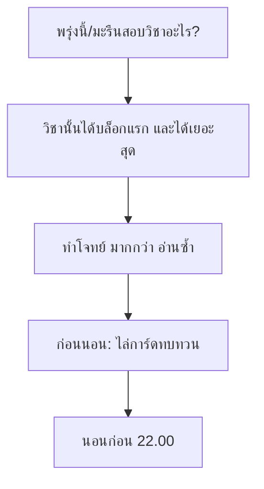

# ตารางทบทวนก่อนสอบปลายภาค 1/2569 (ม.5)

> [!abstract] สรุปในหนึ่งบรรทัด
> สอบ 3 วัน: **จันทร์ 21 • พุธ 23 • ศุกร์ 25 กันยายน 2569** — ใช้แผน "ทบทวนย้อนจากวันสอบ" เรียนเข้มช่วงบ่ายถึง 17.00 ทุกวัน โดยวิชาที่สอบถัดไปได้บล็อกแรกเสมอ

## ⏱ กติกาบล็อกเวลา

| รูปแบบวัน | เวลาใช้จริง | จำนวนบล็อก |
|---|---|---|
| วันไม่มีสอบ | 13.00–17.00 | 4 บล็อก (13.00 / 14.00 / 15.00 / 16.00) |
| วันสอบ | 15.00–17.00 (พักหลังสอบ ~45 นาที) | 2 บล็อก |
| โบนัสเช้า (ถ้าว่าง) | 9.00–11.50 | บล็อกเสริม — ให้วิชาที่สอบถัดไปก่อน |

- 1 บล็อก = **50 นาทีเรียนเข้ม + 10 นาทีพัก**
- วิชาที่สอบ 90/75 นาที (วิชาหลัก) ได้ **2 บล็อกต่อวัน** เพราะต้องซ้อมทำโจทย์
- วิชาเนื้อหาน้อย (สุขศึกษา, วิชา 40–45 นาที) จัดไว้ท้ายบล็อกพอดี

## 🖼 ภาพประกอบ

<svg width="420" height="350" viewBox="0 0 420 350" xmlns="http://www.w3.org/2000/svg">
  <!-- เส้นเชื่อมวัน -->
  <line x1="51" y1="44" x2="51" y2="316" stroke="#868e96" stroke-width="2"/>
  <!-- ชื่อภาพ -->
  <text x="10" y="22" font-size="14" font-weight="bold" fill="#333">ภาพรวมสัปดาห์สอบ 19–25 ก.ย. 2569</text>
  <!-- คำอธิบายสี -->
  <rect x="300" y="12" width="13" height="13" fill="#4dabf7" fill-opacity="0.35" stroke="#1971c2"/>
  <text x="317" y="23" font-size="12" fill="#333">ทบทวน</text>
  <rect x="364" y="12" width="13" height="13" fill="#ff8787" fill-opacity="0.35" stroke="#e03131"/>
  <text x="381" y="23" font-size="12" fill="#333">สอบ</text>

  <!-- แถว 1: เสาร์ 19 -->
  <rect x="8" y="34" width="86" height="36" rx="8" fill="#4dabf7" fill-opacity="0.3" stroke="#1971c2" stroke-width="2"/>
  <text x="51" y="50" font-size="13" font-weight="bold" fill="#333" text-anchor="middle">เสาร์</text>
  <text x="51" y="65" font-size="12" fill="#333" text-anchor="middle">19 ก.ย. วันนี้</text>
  <rect x="100" y="34" width="312" height="36" rx="8" fill="#4dabf7" fill-opacity="0.25" stroke="#1971c2"/>
  <text x="110" y="50" font-size="13" font-weight="bold" fill="#333">เปิดสนาม — กลุ่มสอบวันจันทร์</text>
  <text x="110" y="65" font-size="12" fill="#333">เคมี (หนักสุด) • คอม • สุขศึกษา</text>

  <!-- แถว 2: อาทิตย์ 20 -->
  <rect x="8" y="78" width="86" height="36" rx="8" fill="#4dabf7" fill-opacity="0.3" stroke="#1971c2"/>
  <text x="51" y="94" font-size="13" font-weight="bold" fill="#333" text-anchor="middle">อาทิตย์</text>
  <text x="51" y="109" font-size="12" fill="#333" text-anchor="middle">20 ก.ย.</text>
  <rect x="100" y="78" width="312" height="36" rx="8" fill="#4dabf7" fill-opacity="0.25" stroke="#1971c2"/>
  <text x="110" y="94" font-size="13" font-weight="bold" fill="#333">ปิดกลุ่มสอบวันจันทร์</text>
  <text x="110" y="109" font-size="12" fill="#333">โจทย์เก่า + ไล่สารบัญให้ครบทุกวิชา</text>

  <!-- แถว 3: จันทร์ 21 (สอบ) -->
  <rect x="8" y="122" width="86" height="36" rx="8" fill="#ff8787" fill-opacity="0.35" stroke="#e03131" stroke-width="2"/>
  <text x="51" y="138" font-size="13" font-weight="bold" fill="#333" text-anchor="middle">จันทร์</text>
  <text x="51" y="153" font-size="12" fill="#333" text-anchor="middle">21 ก.ย.</text>
  <rect x="100" y="122" width="312" height="36" rx="8" fill="#ff8787" fill-opacity="0.3" stroke="#e03131"/>
  <text x="110" y="138" font-size="13" font-weight="bold" fill="#333">📝 สอบวันแรก 4 วิชา</text>
  <text x="110" y="153" font-size="12" fill="#333">คอม • สุขศึกษา • เคมี 90 นาที • ❓ | บ่าย: ฟิสิกส์</text>

  <!-- แถว 4: อังคาร 22 -->
  <rect x="8" y="166" width="86" height="36" rx="8" fill="#4dabf7" fill-opacity="0.3" stroke="#1971c2"/>
  <text x="51" y="182" font-size="13" font-weight="bold" fill="#333" text-anchor="middle">อังคาร</text>
  <text x="51" y="197" font-size="12" fill="#333" text-anchor="middle">22 ก.ย.</text>
  <rect x="100" y="166" width="312" height="36" rx="8" fill="#4dabf7" fill-opacity="0.25" stroke="#1971c2"/>
  <text x="110" y="182" font-size="13" font-weight="bold" fill="#333">เตรียมสอบวันพุธ (วันเต็ม)</text>
  <text x="110" y="197" font-size="12" fill="#333">ฟิสิกส์ • วิชาบ่าย 75 นาที ❓ • ปฏิบัติ • ญี่ปุ่น</text>

  <!-- แถว 5: พุธ 23 (สอบ) -->
  <rect x="8" y="210" width="86" height="36" rx="8" fill="#ff8787" fill-opacity="0.35" stroke="#e03131" stroke-width="2"/>
  <text x="51" y="226" font-size="13" font-weight="bold" fill="#333" text-anchor="middle">พุธ</text>
  <text x="51" y="241" font-size="12" fill="#333" text-anchor="middle">23 ก.ย.</text>
  <rect x="100" y="210" width="312" height="36" rx="8" fill="#ff8787" fill-opacity="0.3" stroke="#e03131"/>
  <text x="110" y="226" font-size="13" font-weight="bold" fill="#333">📝 สอบวันที่สอง 4 วิชา</text>
  <text x="110" y="241" font-size="12" fill="#333">ฟิสิกส์ • เลือก • ญี่ปุ่น • 75' ❓ | บ่าย: ชีว+อังกฤษ</text>

  <!-- แถว 6: พฤหัสบดี 24 -->
  <rect x="8" y="254" width="86" height="36" rx="8" fill="#4dabf7" fill-opacity="0.3" stroke="#1971c2"/>
  <text x="51" y="270" font-size="13" font-weight="bold" fill="#333" text-anchor="middle">พฤหัสบดี</text>
  <text x="51" y="285" font-size="12" fill="#333" text-anchor="middle">24 ก.ย.</text>
  <rect x="100" y="254" width="312" height="36" rx="8" fill="#4dabf7" fill-opacity="0.25" stroke="#1971c2"/>
  <text x="110" y="270" font-size="13" font-weight="bold" fill="#333">เตรียมสอบวันศุกร์ (วันเต็ม)</text>
  <text x="110" y="285" font-size="12" fill="#333">ชีววิทยา (หนักสุด) • อ่านอังกฤษ • ภาษาเลือก</text>

  <!-- แถว 7: ศุกร์ 25 (สอบ) -->
  <rect x="8" y="298" width="86" height="36" rx="8" fill="#ff8787" fill-opacity="0.35" stroke="#e03131" stroke-width="2"/>
  <text x="51" y="314" font-size="13" font-weight="bold" fill="#333" text-anchor="middle">ศุกร์</text>
  <text x="51" y="329" font-size="12" fill="#333" text-anchor="middle">25 ก.ย.</text>
  <rect x="100" y="298" width="312" height="36" rx="8" fill="#ff8787" fill-opacity="0.3" stroke="#e03131"/>
  <text x="110" y="314" font-size="13" font-weight="bold" fill="#333">📝 สอบวันสุดท้าย — จบแล้ว! 🎉</text>
  <text x="110" y="329" font-size="12" fill="#2f9e44">อ่านอังกฤษ • ภาษาเลือก • บ่าย ❓ → ไปฉลองได้!</text>
</svg>

## 📋 ตารางสอบของ ม.5 (อ่านจากรูป)

> [!warning] เช็คก่อนใช้!
> ช่องที่ขึ้น **❓** คือชื่อวิชาที่**โดนเครื่องหมายแดงทับ**ในรูป หรืออ่านได้ไม่ครบ — ยืนยันกับตารางจริง/เพื่อนก่อนเริ่มทบทวน อย่าทบทวนผิดตัว! ส่วน**วัน–เวลา**อ่านได้ชัดเจน

| วัน | เวลา | นาที | วิชา |
|---|---|---|---|
| จ. 21 ก.ย. | 08.30–09.30 | 60 | วิทยาการคำนวณ 1 |
| | 09.40–10.20 | 40 | สุขศึกษา |
| | 10.30–12.00 | 90 | เคมีพื้นฐานเพื่อวิทยาศาสตร์ |
| | 13.00–14.00 | 60 | ❓ (ชื่อโดนแดงทับ) |
| พ. 23 ก.ย. | 08.30–09.30 | 60 | ฟิสิกส์ ❓ |
| | 09.40–10.40 | 60 | วิชาปฏิบัติ/เลือก ❓ |
| | 10.50–11.50 | 60 | ภาษาญี่ปุ่นเพื่อการสื่อสาร ❓ |
| | 13.00–14.15 | 75 | วิชาหลัก ❓ (เคมี หรือ ฟิสิกส์) |
| ศ. 25 ก.ย. | 08.30–09.30 | 60 | การอ่านอังกฤษเพื่อค้นคว้า ❓ |
| | 09.40–10.40 | 60 | ภาษาเลือก ❓ (ฝรั่งเศส/จีน) |
| | 10.50–11.35 | 45 | ❓ |
| | 13.00–14.15 | 75 | วิชาบ่าย ❓ |
| | 12.30–13.30 | 60 | ชีววิทยา ❓ (เวลาซ้อนกับแถวบน — ต้องเช็ค!) |

## 🗓 แผนรายวัน

### เสาร์ที่ 19 (วันนี้) — เปิดสนาม: กลุ่มสอบวันจันทร์

| เวลา | สิ่งที่ต้องทำ |
|---|---|
| 13.00–13.50 | **เคมีพื้นฐาน** — ไล่สารบัญทั้งเทอม วงบทที่อ่อนที่สุด 3 บท |
| 14.00–14.50 | **เคมี** — บทอ่อนอันดับ 1: อ่านสรุป + ทำโจทย์ท้ายบท |
| 15.00–15.50 | **วิทยาการคำนวณ** — ทวนโน้ต/งานที่เคยทำ + ศัพท์เทคนิคที่ออกสอบบ่อย |
| 16.00–16.50 | **สุขศึกษา** — อ่านข้ามเร็ว ขีดคำสำคัญ (เนื้อน้อย อย่าใช้เวลามาก) |

### อาทิตย์ที่ 20 — ปิดกลุ่มสอบวันจันทร์

| เวลา | สิ่งที่ต้องทำ |
|---|---|
| 13.00–13.50 | **เคมี** — บทอ่อนอันดับ 2 + ลองทำข้อสอบเก่า |
| 14.00–14.50 | **เคมี** — ปิดเล่น เขียนสูตร/สมการที่ต้องจำออกมาจากหัว แล้วเปิดเช็ค |
| 15.00–15.50 | **วิทยาการคำนวณ** — แนวข้อสอบ + ทวนส่วนที่พลาดบ่อย |
| 16.00–16.50 | **สุขศึกษา** — ทวนคำสำคัญ + ไล่สารบัญทุกวิชาสอบพรุ่งนี้ให้ครบ |

> [!tip] ค่ำนี้
> เตรียมอุปกรณ์ให้พร้อม แล้ว**นอนก่อน 22.00** — สมองพร้อมสู้สำคัญกว่าอ่านตีสอง

### จันทร์ที่ 21 — สอบวันแรก (08.30–14.00)

- เช้า: ตื่นมาไล่การ์ดทบทวน 15 นาที — **ห้ามอ่านเนื้อหาใหม่**
- พักเที่ยง: ทานข้าวเบา ๆ และอย่าคุยเรื่องข้อสอบที่เพิ่งจบ (ตัดอารมณ์ให้เนื้องานหน้า)

| เวลา | สิ่งที่ต้องทำ |
|---|---|
| 15.00–15.50 | **ฟิสิกส์** (สอบพุธ) — เขียนสูตรหลักทั้งเทอมจากหัว แล้วเปิดเช็ค |
| 16.00–16.50 | **ฟิสิกส์** — โจทย์เก่า 5–8 ข้อ เน้นแนวที่ออกบ่อย |

### อังคารที่ 22 — วันเต็ม: กลุ่มสอบวันพุธ

โบนัสเช้า (ถ้าว่าง): ฟิสิกส์ต่ออีก 1–2 บล็อก

| เวลา | สิ่งที่ต้องทำ |
|---|---|
| 13.00–13.50 | **ฟิสิกส์** — ทวนบทหลัก + ทบทวนโจทย์ที่เคยผิด |
| 14.00–14.50 | **วิชาหลักช่วงบ่ายวันพุธ (75 นาที) ❓** — ทวนสรุป + โจทย์ |
| 15.00–15.50 | **วิชาปฏิบัติ/เลือก ❓** — ทวนขั้นตอน/รายงานที่เรียนมา |
| 16.00–16.50 | **ภาษาญี่ปุ่นเพื่อการสื่อสาร ❓** — คำศัพท์ + แบบประโยค + ไล่สารบัญครบทุกวิชาสอบพรุ่งนี้ |

### พุธที่ 23 — สอบวันที่สอง (08.30–14.15)

| เวลา | สิ่งที่ต้องทำ |
|---|---|
| 15.00–15.50 | **ชีววิทยา** (สอบศุกร์) — ไล่เนื้อหาเทอมนี้ สรุปศัพท์และกระบวนการสำคัญ |
| 16.00–16.50 | **การอ่านอังกฤษ** — ศัพท์จากบทเรียน + แนวข้อสอบ |

### พฤหัสบดีที่ 24 — วันเต็ม: กลุ่มสอบวันศุกร์

โบนัสเช้า (ถ้าว่าง): ชีววิทยาโจทย์ 1–2 บล็อก

| เวลา | สิ่งที่ต้องทำ |
|---|---|
| 13.00–13.50 | **ชีววิทยา** — บทหลัก + วาดแผนภาพซ้ำจากหัว |
| 14.00–14.50 | **ชีววิทยา** — โจทย์เก่า + สรุปย่อให้จบในหน้าเดียว |
| 15.00–15.50 | **อ่านอังกฤษ + ภาษาเลือก ❓** — ศัพท์/ประโยคสำคัญ |
| 16.00–16.50 | **วิชาบ่ายวันศุกร์ (75 นาที) ❓** + ไล่สารบัญครบ + เตรียมอุปกรณ์ |

### ศุกร์ที่ 25 — สอบวันสุดท้าย 🎉

- เช้า: ไล่การ์ดทบทวน 15 นาที → เข้าห้องอย่างมั่นใจ
- สอบเสร็จ = ภารกิจสำเร็จ ไปฉลองได้เลย!

## 🧠 หลักการทบทวนให้จำได้จริง

- **Active recall ชนะการอ่านซ้ำ** — ปิดเล่น ตอบเอง พูดออกมา ทำโจทย์ แล้วค่อยเปิดเช็ค
- **ข้อสอบเก่าคือของจริง** — ถามพี่ ๆ / เพื่อนห้องข้าง ๆ ว่าแนวไหนออกบ่อย แล้วซ้อมแนวนั้น
- **วิชา 90/75 นาที** (เคมี, ฟิสิกส์) คือวิชาหลัก ต้องซ้อมมือทำโจทย์ล่วงหน้า
- **ก่อนนอนทุกคืน** ไล่การ์ดทบทวนของวิชาที่สอบวันถัดไป — สมองจัดการความจำระหว่างหลับ

## ⚠️ ข้อควรระวัง

> [!warning] ข้อผิดพลาดที่พบบ่อย
> 1. **อย่าเชื่อชื่อวิชา ❓ จนกว่าจะเช็ค** — ตารางในรูปโดนแดงทับหลายช่อง และแถวบ่ายวันศุกร์เวลาซ้อนกัน (12.30–13.30 กับ 13.00–14.15) ต้องถามครูที่ปรึกษาให้ชัด
> 2. **ห้ามอ่านเนื้อหาใหม่วันสอบ** — ไล่เฉพาะสรุปและการ์ดทบทวนเท่านั้น
> 3. **นอนอย่างน้อย 7 ชั่วโมง** — การนอนคือการทบทวนรอบสุดท้ายของสมอง
> 4. **พัก 10 นาที ห้ามจับมือถือ** — สมองต้องพักจริง ไม่งั้นสิ่งที่เพิ่งเรียนจะหลุด
> 5. **อย่าทบทวนวิชาเดียวจนหมดวัน** — สลับวิชาทุกบล็อก จำได้นานกว่า

## 🎒 เช็กลิสต์ก่อนเข้าห้องสอบ

- [ ] บัตรประชาชน / บัตรนักเรียน
- [ ] ดินสอ 2B + ยางลบ + ปากกา (เตรียมสำรอง)
- [ ] เครื่องคิดเลข (เคมี/ฟิสิกส์) — เช็ครุ่นที่โรงเรียนอนุญาต
- [ ] นาฬิกาข้อมือ (ห้องสอบบางห้องดูเวลายาก)
- [ ] น้ำดื่ม + ขนมช่วงพักสั้น
- [ ] เลขที่นั่งสอบ/ห้องสอบของตัวเอง (เช็คประกาศหน้าห้อง)

## 🎴 การ์ดทบทวน #flashcards

สอบวันจันทร์ที่ 21 ก.ย. วิชาอะไรบ้าง?::วิทยาการคำนวณ (08.30) • สุขศึกษา (09.40) • เคมีพื้นฐาน 90 นาที (10.30) • วิชาบ่าย ❓ (13.00)

สอบวันพุธที่ 23 ก.ย. วิชาอะไรบ้าง?::ฟิสิกส์ (08.30) • วิชาปฏิบัติ/เลือก (09.40) • ภาษาญี่ปุ่นเพื่อการสื่อสาร (10.50) • วิชาหลัก 75 นาที ❓ (13.00)

สอบวันศุกร์ที่ 25 ก.ย. วิชาอะไรบ้าง?::การอ่านอังกฤษ (08.30) • ภาษาเลือก ❓ (09.40) • วิชา 45 นาที ❓ (10.50) • วิชาบ่าย 75 นาที ❓ (13.00)

1 บล็อกการเรียนในแผนนี้ยาวเท่าไร?::50 นาทีเรียนเข้ม + 10 นาทีพัก (จบ 17.00 ทุกวัน)

ก่อนนอนคืนก่อนสอบควรทำอะไร?::ไล่การ์ดทบทวน/สรุปของวิชาที่สอบพรุ่งนี้ แล้วนอนก่อน 22.00

เทคนิคทบทวนที่ได้ผลกว่าการอ่านซ้ำ?::Active recall — ปิดเล่น ตอบเอง ทำโจทย์ แล้วค่อยเช็คเฉลย

## 🔗 หัวข้อที่เกี่ยวข้อง

ยังไม่มีโน้ตเหล่านี้ใน vault — ขอให้ผมสร้างได้เลย:

- [[เคมีพื้นฐาน ม.5]] — วิชา 90 นาทีวันจันทร์ ควรมีโน้ตสรุปสูตร/สมการ
- [[ฟิสิกส์ ม.5]] — รวมสูตรทั้งเทอมไว้ไล่ก่อนสอบพุธ
- [[ชีววิทยา ม.5]] — ศัพท์วิทย์และแผนภาพที่ต้องวาดซ้ำ
- [[เทคนิคการทบทวนแบบ Active Recall]] — หลักการจำที่ใช้ในแผนนี้ทั้งหมด
